# Tunnel Focus: Time Your Tasks
## Code Institute Milestone Project 2: Interactive Front-End Development

Tunnel Focus is a browser based task manager with a difference. 
A key methodology of Agile Development is breaking large projects up into smaller tasks as a way to get things done efficiently. 

For many people focusing on a task "until it's done" is not the most efficient way to complete it, as your mind can wander and concentration can lag.
Focusing in small bursts and maintaining intense focus for small periods of time, punctuated by regular breaks can yield massive benefits in terms of work efficiency.

This web application has been conceptualised and designed around that premise: small bursts of 
productivity which added together result in successfully completed tasks and projects. Tunnel Focus works as a simple task manager, except that it also keeps track of 
how long a user works on a particular task. As such, it can be used to help with and encourage an Agile approach to development or any other area that requires task management. 

It combines a stopwatch timer with two pomodoro timers, one for 15 minutes and one for 25 minutes. It was specifically designed to only accommodate these two time segments because they have been [studied and shown](https://www.sciencedaily.com/releases/2011/02/110208131529.htm) to be the most effective time periods for human bursts of focus. 

<a href="https://kairosity.github.io/mp2-tunnel-focus/">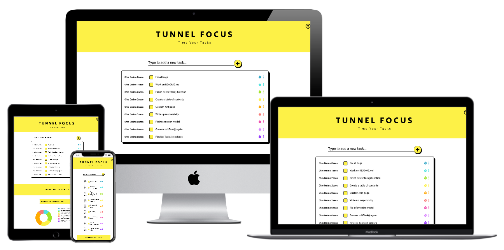</a>

## [View the Live Website Here](https://kairosity.github.io/mp2-tunnel-focus/)

# Table Of Contents

- [1. UX](#ux)
  * [User Stories](#user-stories)
      - [*First Time User Stories*](#first-time-user-stories)
      - [*Returning User Stories*](#returning-user-stories)
      - [*Accessibility User Stories*](#accessibility-user-stories)
  * [Strategy](#strategy)
      - [*Project Goals*](#project-goals)
      - [*Target Users*](#target-users)
      - [*Research*](#research)
  * [Scope](#scope)
    - [*Core Theme*](#core-theme)
    - [*Scope Feature Ideas Table*](#scope-feature-list-table)
    - [*Scope Final Features*](#scope-final-features)
  * [Structure](#structure)
      - [*Application Sections*](#application-sections)
      - [*Website Flow*](#website-flow)
      - [*Interaction Design*](#interaction-design)
      - [*Information Architecture*](#information-architecture)
  * [Skeleton](#skeleton)
      - [*Reassuring Conventions*](#reassuring-conventions)
      - [*Wireframes*](#wireframes)
  * [Surface](#surface)
      - [*Design Considerations*](#design-considerations)
      - [*Colour Palette*](#colour-palette)
      - [*Typography*](#typography)
      - [*Design Mockups*](#design-mockups)
- [2. Features](#features)
    - [Landing Page](#1.-landing-page)
        - [*Landing Page Design*](#landing-page-design)
    - [Information Modal](#2.-information-modal)
    - [Adding a task to the list](#3.-adding-a-task-to-the-list)
         - [*Task Addition Special Features*](#task-addition-special-features)
    - [Editing a task](#4.-editing-a-task)
         - [*Task Edit Special Features*](#task-edit-special-features)
     - [Deleting a task](#5.-deleting-a-task)
         - [*Task Deletion Special Features*](#task-deletion-special-features)
    - [Checking a task as Complete](#6.-checking-a-task-as-complete)
         - [*Task Completion Special Features*](#task-completion-special-features)
     - [Navigation](#7.-navigation)
         - [*Navigation Special Features*](#navigation-special-features)
    - [Timers. Stopwatch and Countdowns](#8.-timers.-stopwatch-and-countdowns)
        - [*Timer Special Features*](#timer-special-features)
    - [Productivity Charts](#9.-productivity-charts)
        - [*Chart Design*](#chart-design)
        - [*Chart Substance*](#chart-substance)
        - [*Charts Special Features*](#charts-special-features)
- [3. Mobile-First Responsivity](#mobile-first-responsivity)
    - [Mobile xs and sm breakpoints](#mobile-xs-and-sm-breakpoints)
    - [iPads and md breakpoints](#ipads-and-md-breakpoints)
    - [Desktops lg and xl breakpoints](#desktops-lg-and-xl-breakpoints)
- [4. Accessibility](#accessibility)
    - [Event Listeners](#1.-event-listeners)
    - [Skip Tasks](#2.-skip-tasks)
    - [Screen Reader Accessibility](#3.-screen-reader-accessibility)
    - [Zoom Ratio](#4.-zoom-ratio)
- [5. Potential Features for Future Releases](#potential-features-for-future-releases)
- [6. Testing](#testing)
- [7. Issues and Room for Improvement](#issues-and-room-for-improvement)
- [8. Attribution](#attribution)
- [9. Deployment](#deployment)
    - [Publishing to Github Pages](#publishing-to-github-pages)
- [10. Tools and Other Resources Used](#tools-and-other-resources-used)
    - [Design](#1.-design)
    - [HTML and CSS](#2.-html-and-css)
    - [JavaScript](#3.-javascript)
    - [D3.js](#4.-d3.js)
    - [Git and GitHub](#5.-git-and-github)
    - [Frameworks](#6.-frameworks)
    - [General](#7.-general)
- [11. Technology Used](#technology-used)
- [12. Acknowledgements](#acknowledgments) 

# UX

## User Stories 

The application is targeted at any user who requires a task manager for any purpose. It is particularly useful for anyone working on a large project with a lot of working parts.

### First Time User Stories

__*As a first time user:*__
- I want to be able to easily and clearly understand the purpose of this web application.
- I want to be able to quickly and easily understand how to navigate the application. 
- I want the application to be visually appealing and have a clean interface that is easy to view.

 __*As a user:*__
    
- I want to be able to add tasks to a list.
- I want to be able to edit a task.
- I want to be able to check off tasks when they are completed.
- I want to be able to delete a task.

- I want to be able to start the focus timer when I start working on a particular task.
- I want to be able to pause the focus timer if I take a break. 
- I want to be able to reset the focus timer for that particular segment of time, if for whatever reason I don't actually focus on work.

- I want to be able to start a countdown timer for work on a particular task.
- I want to be able to select whether the countdown timer runs for 15 or 25 minutes.
- When the countdown timer ends, I want to be alerted with an audio alarm and/or a visual display. 
- I want to have the option of turning off the audio alarm and relying on just 
a visual indication that the countdown is over.

- As a user, I want to be able to start an open-ended timer for longer sessions working on a particular task.
- I want to be alerted after every 30 minutes working with the open-ended timer.
- If I forget that the open-ended timer is running, I want to be able to delete that segment of time and not have it added to the total
time spent focused on that task.  

- I want to know how much time I have spent on each task today.
- I want to know how much time I have spent on each task overall. 
- I want to know how much time I have spent focused and working today.
- I would like to see this information displayed in pleasing and easy to comprehend charts and visuals.
- I would like to see a list of what tasks I completed today.

### Returning User Stories

__*As a returning user:*__ 
- I want my tasks to be stored and recalled when I navigate to the webpage.
- I want all the specifics associated with the tasks to be loaded correctly and accurately.

### Accessibility User Stories

- As a user who is __*hard of hearing*__, I want there to be a visual display when the countdown timer ends. 
- As a user who is __*colourblind*__, I want the colours used to employ sufficient contrast so that any visual cues are apparent to me.
- As a user who is __*physically impaired*__ I want to be able to use the keyboard to navigate and fully interact with the application.
- As a user who uses __*screen reader technology*__ I want my screen reader to be able to access all the controls and elements of the page and describe them to be correctly.  

## Strategy

### __*Project Goals*__
- Create a time based task manager for project development 
- Create a simple product that can be used in the browser and with local storage.
- Create a product that is intuitive and useful for anyone working on a particular set of tasks. 
- Create a product that is scalable and has potential to develop further into a fully blown application with database storage. 
- Create an application that has clean lines and is minimal in design. 
- Bright toned design, whites, light greys and bright and cheery accent colours. 
- Encourage the use of sprint methodology when working to complete tasks.

### __*Target Users*__
The target users are people working on a series of tasks and particularly people employing a sprint methodology for task completion. 

### __*Research*__
I researched other task managers online and found a number that have similar functionality, but all were behind paywalls. I could not find a free and simple task manager with timer functionality. This was actually something I had also looked for before designing this application. 


## Scope

### Core theme
The basis for this application's scope, was actually to create an app I wanted to use for my own projects. I've used a variety of task managers over the years, 
and have always reverted to just writing lists on paper, which I still believe is a powerful method for many reasons. 

However, the one functionality I always felt was lacking from your run-of-the-mill online todo list / task manager, was the ability to time tasks. The internet is replete with 
todo lists and pomodoro timers and I felt they are most useful when combined. 

So the basic and general scope for this project is:
- A todo list with timer functionality. 

To further define both the task list functionality and features for the timer and the task manager components, I began by sketching out exactly what I would like to use and then I
spoke to friends in various creative and professional industries to see what ideas they could contribute. A timer functionality is most attractive to users who work on a varied list of projects 
that can be broken into smaller tasks. Because I got back such a wide variety of feature requests I sketched out the feature list chart displayed below to help me decide on what to include.

### Scope Feature Ideas Table

#|Opportunity/Potential Feature | Importance | Viability | Score
---|------------ | -------------|--------------|------------------
. | __*TASK LIST FUNCTIONALITY & FEATURES*__ 
1.| Add tasks to the task List  | 5 | 5 | 10
2.| Edit tasks | 5 | 5 | 10
3.| Delete tasks | 5 | 5 | 10
4.| Check tasks as completed | 5 | 5 | 10
5.| Add multiple task lists for different categories of tasks / different projects |2 | 3 | 5
6.| Add due-dates for tasks |2 | 4 | 6
7.| Sync task lists to Google Calendar API |2 | 2 | 4
8.| Speech to text functionality for adding tasks to lists |2 | 2 | 4
. | __*TASK TIMER FUNCTIONALITY & FEATURES*__ 
1.| Pomodoro style timer of 25 minutes |3 | 5 | 8
2.| Pomodoro style timer of 15 minutes |2 | 5 | 7
3.| Pomodoro style break time segments |1 | 3 | 4
4.| Allow users to select their own Pomodoro time length |2 | 3 | 5
5.| Stopwatch open-ended timer |4 | 5 | 9
6.| Focus Reminder Beeps / Pop-up messages |2 | 3 | 5
. | __*TASK CHARTS FUNCTIONALITY & FEATURES*__ 
1.| A display showing the total time focused "today" |4 | 4 | 8
2.| A display showing the total time focused overall |2 | 4 | 6
3.| A Chart showing the time focused on each task "today" |4 | 4 | 8
4.| A Chart showing the time focused on each task overall |3 | 4 | 7
5.| A Chart showing the amount of time segments per task and their times |2 | 2 | 4
6.| Weekly and monthly charts of time spent per task |2 | 2 | 4
7.| A list of tasks completed today |3 | 5 | 8
8.| A list of tasks completed overall |2 | 5 | 7
. | __*OTHER FUNCTIONALITY & FEATURES*__ 
1.| Randomly selected affirmations/quotes about work that appear when the timer is on |2 | 3 | 5
2.| Wage calculations for users who work by the hour/time period |1 | 2 | 3
3.| Display weather for the day at the top of the screen |1 | 3 | 4
 

### Scope Final Features

 The scope was eventually narrowed down to include the following from each section: 

__*TASK LIST FUNCTIONALITY & FEATURES*__
1. Add tasks to the tasklist
2. Edit tasks
3. Delete tasks 
4. Check tasks as completed 

__*TASK TIMER FUNCTIONALITY & FEATURES*__
1. Pomodoro style timer of 25 minutes
2. Pomodoro style timer of 15 minutes
3. Stopwatch open-ended timer
4. Focus reminder beeps on the stopwatch timer after every 30 minutes.  
5. Alarms when the countdown timers finish - both audio & visual options (not in original scope plan). 

__*TASK CHARTS FUNCTIONALITY & FEATURES*__
1. A Chart showing the time focused on each task "today" (charts & displays were merged as both would have been overkill)
2. A Chart showing the time focused on each task overall
3. A list of tasks completed today.
4. A list of tasks completed overall. 

None of the additional functionality / features were included in the final application's scope.


I kept the scope quite tight to the basic functionality of the application and while there is scope for expansion, I like the narrow nature of the features because I think it achieves what it sets out to do cleanly and effectively. 


## Structure

### Application Sections

- The original structure for this application was to have 1 view on desktop screens and two main views on mobile, but as the application evolved through development, that changed and the mobile version was altered to fit desktop as well. So the structure across the board is based on 1 main view and multiple modal views as the user interacts with the application's features.

**Main View:**

1. Header with Headings & button for more detailed information about the application. 

2. An "add new task" input element with a plus button.

3. The task list area.

    Incorporating the task line when a user adds a task.
    The task line features:

    - The total amount of time saved to that particular task.
    - A checkbox to check the task as complete.
    - The task name / description.
    - The "start stopwatch" task timer icon. 
    - An ellipsis icon that opens a popover modal displaying more options. 

    Those options include:
    - Edit Task: which opens a modal. 
    - Delete task: which opens a mini confirmation modal.
    - 15 minute countdown / pomodoro timer. 
    - 25 minute countdown / pomodoro timer.  

4. Productivity charts heading. 

5. Productivity charts / completed tasks lists. 

6. Footer Area.


This view is the same regardless of whether a user is on mobile or desktop screens. Only the styles are altered to ensure a great user experience, but the structure is identical. During the design process I realised that having two different structures for mobile & desktop could lead to confusion and a less than ideal UX. 

**Modal / Feature Views**

1. Timer View: A yellow overlay covers the rest of the application and the timer sits on top of it. The user can only interact with the timer when the timer is open. This is in keeping with how the application is supposed to be used. As it's all about tunnel focus, the ability to interact with other elements of the application when a specific task is being timed would not be in keeping with the ethos of the application. 

2. Edit Task View: Similar to the timer, this view is also a modal sitting on top of an overlay. A user can edit the task name and the amount of time associated with that task. 

3. Chart Views: These all really happen on the main view, however the charts themselves change depending on which chart / list is selected. 

The UI structure is based on the idea of a dashboard layout, but instead of filling all the white space as is customary with dashboards, I wanted to keep the task list center stage, to re-emphasize the "Focus" aspect of the application. This strategy also ensures that the design remains clean and visually uncomplicated. 

### Website Flow

As I've just outlined, most of this application takes place on one main page, with modals for the timer feature and edit task. The idea is that when a user starts the timer, they will be initiating a burst of productivity that will take up their entire focus.  

The flow is very much focused around the task list and the timer. The charts are a point of interest and reference, but they are scrolled down to, as they need not take center stage. 

The structure here is somewhat non-linear, but it is so simple that the linear/non-linear conceptualisation is of limited use.

### Interaction Design

My guiding principle when designing and then re-designing and modifying my original concept was to keep this application simple and effective at doing what it does. "As simple as possible, but no simpler." (Einstein)

I wanted especially to combine a minimalism of design with a minimalism and clarity of interaction, and although I did include an information modal as an informative fallback, I don't think it was necessary, as I believe the interaction design is clean and intuitive. 

The interaction is consistent and predictable, once a user works their way through all the options once, it is easily learned and easy to remember, even for a first time user. 

The **only** tiny aspect that I believe might need to be "learned" is that the stopwatch timer on the task line counts up and not down like the two pomodoro timers. I was aware of this small ambiguity but decided against including any greater clarification for the simple reason that once it is clicked, its function is quickly apparent. "Stopwatch" is written clearly across the top of the timer, and the user will see the time counting upwards. If they had not intended to start timing that task, they can easily cancel out of the timer by using the conventional X button in the top right hand corner.

Which brings me to another strong aspect of my interaction design, I've chosen to include small modals that confirm all the user's decisions. When a user clicks to "Save Time To Task" a modal appears that asks them to confirm that save. When they go to delete a task, they are also prompted to confirm the deletion. This both anticipates user errors and avoids the frustration of them accidentally deleting a task or exiting a timer **and** it enhances user trust in the application. 

<p align="center">
  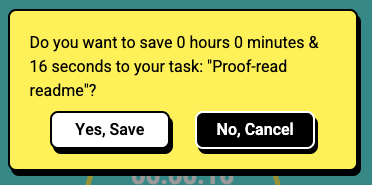
  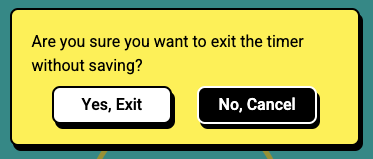
  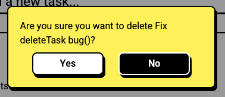
</p>

Within these confirmation modals I've also included specific information i.e. the task name & (for the save time function) the amount of time to be saved. This communicates and reinforces what they are doing in an elegant and detailed manner that enhances both usability, UX & trust in the application. 

To further assure users and increase positive UX, I've included some subtle but fun hover effects on almost all of my buttons and icons. The task line icons and the timer icons tilt and scale up ever so slightly when hovered, the popover navigation includes a yellow background on hovera and almost all of the buttons (with the exception of the information button) have an animated box shadow effect when hovered, finally the checkboxes increase in size and display a rainbow effect. These hover effects add a fun twist to the application and they work to further affirm a user's interaction decisions. 

The information button was excluded from having any hover effects, because it is not an integral part of the application, and is only present as a fallback, or should a user want more detailed information. 

As an aside, I initially also had the idea of including an affirmations API that would bring up inspiring work related quotes as the timer was running, but I then felt that was unneccesarily complicated and somewhat removed from the whole point of the application, which is to focus on only one thing at a time. 


### Information Architecture

The structure is a sort of blend of the dashboard build with hub & spoke. The main page is a dashboard, with lists & charts and information, but when you time a task, the user opens up a modal and when they close that modal they are brought back to the main view. In any future releases I would forsee keeping that main dashboard view and any new features being added as further spokes off that main page. 

## Skeleton

As aforementioned the dashboard/hub & spoke hybrid built has lent itself to an application that I believe is clear and efficiently does what it sets out to do without confusing the user. 

### Reassuring Conventions

- The purpose of the application is clear from the landing page, both the headings and the "Type to add a new task" input, leave no room for confusion. 

- To double-down on this clarity and as a fallback for the super uncertain user, I have also included an informational modal that is accessible by clicking on the question mark icon in the upper right hand corner of the header. 

- The page elements have been grouped together in logical segments and the most important element (the task list) takes centre stage with the charts below it and the timers open on top of it. 

- Visually the colours and bright, but clean and I have limited the features to those necessary to achieve a timed task list. Keeping it simple decreases the cognitive load on the user and increases UX. 

- Thankfully font awesome includes some brilliant icons that enabled me to represent the various features using strong metaphorical concepts further simplifying and enhancing user decision-making and understanding.

### Wireframes

[My full Figma workspace for this project including wireframes, mockups, colour palette & typography, can be viewed here.](https://www.figma.com/file/3LBKUPc79uP1qAKMfSBXKs/Wireframes1?node-id=0%3A1)

__*Alternatively here are the individual wireframes:*__

1. [1st draft wireframes: pen on paper: A](assets/wireframes/wireframe1.jpg)
2. [1st draft wireframes: pen on paper: B](assets/wireframes/wireframe2.jpg)
3. [Mobile Wireframes 2nd Draft](assets/wireframes/mobile-wireframes-2nd-draft.png)
4. [Mobile Wireframes - Final Draft](assets/wireframes/mobile-wireframes.png)
5. [Tablet Wireframes - Final Draft](assets/wireframes/tablet-wireframes.png)
6. [Desktop Wireframes - Final Draft](assets/wireframes/desktop-wireframes.png)

If you choose to view them this way, please click download as the GitHub viewer can expand the smaller files to an uncomfortably large zoom ratio.

## Surface

### Design Considerations

I designed the application to be bright and a little bit fun, as the concept of timing your tasks sits just on the edge of gamifying productivity. So I wanted to bring a hint of that idea into the design. I've designed everything around the task list, which is front and center on all devices.

I used a recurring design theme of hard box shadows on almost all the component frame elements of the design. The modals, the task list, the headers, the chart frame and all the buttons. I liked the faux-retro look of the hard shadows, especially paired with soft 8px-15px border radiuses. 

I then paired these back on mobile screens during the build process, as I felt the hard edges and borders made the site look a tad busy on smaller screens. 

### Colour Palette 
I wanted a bright, fresh and clean somewhat retro look, using bold and happy colours. The two main accent colours are bright yellow and a light bright blue/cyan, with the remaining colours used for small details and for the different charts slices. 

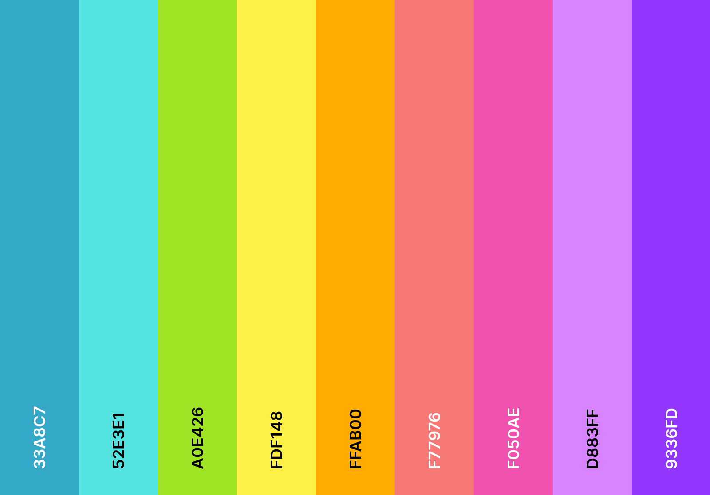

Yellow was specifically chosen as it has been scientifically shown to increase both positivity and creative thought in humans. Psychologically it is the colour of thought and it promotes creativity with action, without inducing hunger (like red). 

### Typography 

#### Headings:

For the typography I wanted a slightly unusual heading font, but nothing with too much flourish. I chose a Google Font that is not used that much: "Secular One" and I modified it by only using uppercase and by increased the letter spacing substantially, thus giving it a distinctive look.

#### Task List, instructions, modals, charts:

For all other fonts, I used another Google Font called Heebo, which is a clean and elegant sans-serif that worked well to stay out of the way of the colourful design. Clear enough and simple enough to present information to the user, without overpowering the look of the application. 

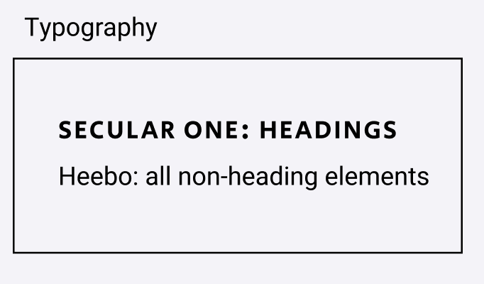

### Design Mockups 
#### Main Mockups
1. [Mobile Mockups](assets/wireframes/mobile-mockups.png)
2. [Tablet Mockups](assets/wireframes/tablet-mockups.png)
3. [Desktop Mockups](assets/wireframes/desktop-mockups.png)

#### Component Mockups
1. [Components Mockups](assets/wireframes/components-mockups.png)
2. [Mobile Timer Mockup](assets/wireframes/mobile-timer-mockup.png)
3. [Task List Mockup](assets/wireframes/task-list-mockup.png)
4. [Desktop Charts Mockup](assets/wireframes/desktop-charts-mockup.png)
5. [Desktop Timer & List Detail Mockup](assets/wireframes/desktop-timer-and-list-detail-mockup.png)
6. [Desktop Timer Mockup](assets/wireframes/desktop-timer-mockup.png)
7. [Manual Task Time Edit Mockup](assets/wireframes/manual-task-time-edit.png)
8. [Modal Mockup](assets/wireframes/modal-mockup.png)
9. [Popover Mockup](assets/wireframes/popover-design.png)
10. [Select Options Mockup](assets/wireframes/select-options-mockup.png)
11. [Typography](assets/wireframes/typography.png) 
12. [Colour Palette](assets/misc-images/color-palette.png)


# Features

## 1. Landing Page

The main page is the springboard for all the features, it contains the task list and the input to add new tasks, as well as the charts that track time on those tasks. It is fully responsive but that will be demonstrated further in the mobile-first responsivity section of this readme.

<p align="center">
  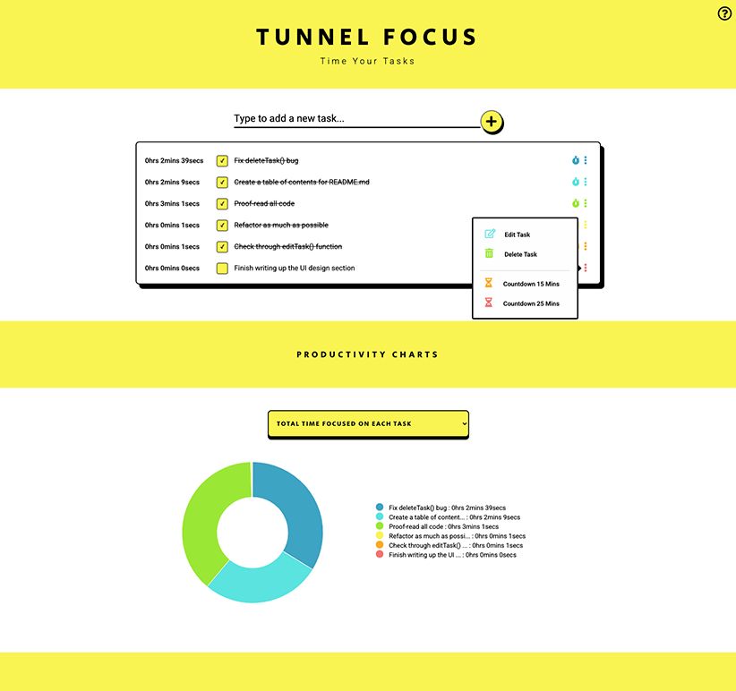
</p>

### Landing Page Design 

The main view was designed to be somewhat minimalist, yet bright and with happy pops of colour. The design and navigation centres around the task list which is easy and uncomplicated to use. 

Underneath the task list the user scrolls down to the productivity charts which only show up once the user adds a task and records some time on that task.

## 2. Information Modal 

I've included information on all the application's features as an explanatory fallback, and this modal is accessed by clicking on the question mark icon in the upper right hand corner.

<p align="center">
  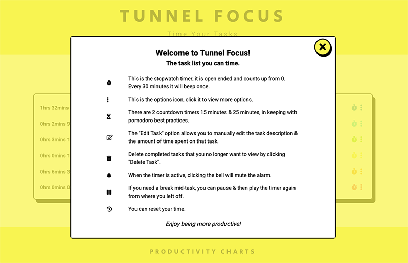
</p>

## 3. Adding a task to the list

This is the first feature the user will see on the landing page, and the most important as the task list is the basis for the rest of the features. The input to add new tasks features the direction "Type to add a new task..." underlined and followed by a + button. All of which is simple and intuitive for the user. When a task is added, the task list is created, with all attendant features. 

<p align="center">
  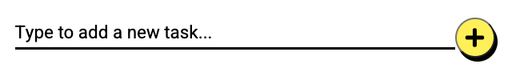
</p>

### Task Addition Special Features 

- A task can be added by clicking the + button with the mouse *or* by pressing enter on the keyboard. 
- The cursor will automatically go back into the input field, making it easy to add multiple tasks quickly. 
- If the user adds unnecessary white space to the beginning or end of the task, it will be automatically removed. 
- If the user fails to add a task, they will be prompted to "Please enter a valid task". 

<p align="center">
  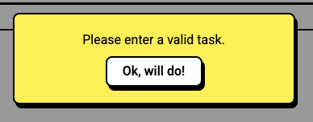
</p>


## 4. Editing a task

Both the task name / description and/or the amount of time associated with focus on that task can be fully edited and changes saved.

### Task Edit Special Features 

- The time can be modified using the mouse and keyboard to enter new numbers.
- OR it can be modified using the tab key and the up & down arrows. 
- OR it can be modified by clicking on the small arrows inside the time inputs. 

<p align="center">
  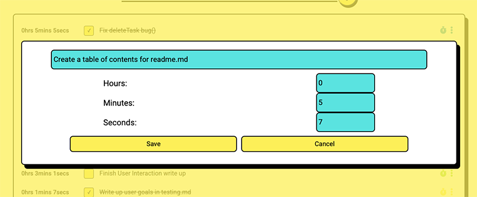
</p>

## 5. Deleting a task 

Users can choose to delete any of their tasks whether or not they are completed. 

### Task Deletion Special Features 

- Users are prompted to confirm that they definitely want to delete a specific task. 
- This handles user errors gracefully and stops a user from accidentally deleting a task they wanted to keep. 

<p align="center">
  
</p>

## 6. Checking a task as complete

Every task on the task list has a checkbox next to its task description, allowing the user to toggle the completed status of a task on and off, as desired. 

### Task Completion Special Features 

- When the checkbox is hovered over with the mouse it scales up in size and turns rainbow-coloured. 
- When tasks are checked, a tick fills the checkbox and a line is drawn through the task description. 

<p align="center">
  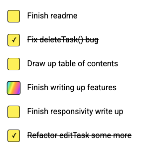
</p>

## 7. Navigation

Other than the stopwatch timer, the rest of the navigation options are available by clicking the ellipsis dots on a particular task. 

### Navigation Special Features 

- The popover is fully responsive, works well on smaller devices and has been customised to react appropriately to user interaction, both via mouse and keyboard.
- It is also ARIA friendly, and screen reader compatible. 
- When an option is hovered over by the mouse, its background turns yellow. 
-  I included a plugin called hideOnPopperBlur which was part of the tippy.js package and that ensured that only one popover could be opened at any one time, so when another element is tabbed to, the popover disappears.
- When an option is selected via click or enter, the popover automatically disappears. This was custom coded as my own plugin called 'hideOnOptionSelect', as the tippy.js code did not default to that functionality.

These customisations enhance the navigation UX and ensure its smooth and accessible functioning. 

(More detail on both of these popover customisations in the testing.md file under the dynamicPopoverNav() section.)

<p align="center">
  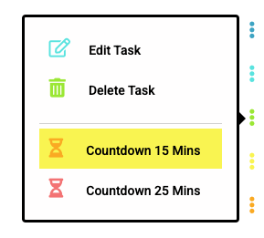
</p>

## 8. Timers. Stopwatch and Countdowns

The timers all share the same modal design, but their title and functionality changes depending on what timer is selected. 

### Timer Special Features 

- The first text on the timer tells the user what timer they are using: 'Stopwatch', 'Countdown 15' or 'Countdown 25'.
- Under that, the task description is displayed.
- The stopwatch timer counts up from 0.
- The stopwatch timer beeps once every 30 minutes to remind the user of the passage of time. 
- The countdown timers count down from 15 & 25 minutes respectively. 
- When the countdown timers get to 0, an audio alarm plays.
- If the alarm toggle button (the bell) is muted on the stopwatch timer, the beep is *not* triggered every 30 minutes.
- If the alarm toggle button is muted on the countdown timers, the audio alarm does not play, but a visual silent alarm does play when the countdown ends. 
- The countdown silent alarm phases through different colours to alert the user that the countdown is completed. 
- When the countdown is complete, the user is asked to confirm that they wish to save the full countdown time to that particular task. They can choose to save or to cancel. 
- The pause button pauses all of the timers. 
- Likewise the play button starts them again from when they were paused. For the stopwatch timer the play button continues the count up, for the countdown timers, the play button continues the count down. 
- The reset button resets the stopwatch timer to 0, and the countdown timers to 15 minutes & 25 minutes respectively. 
- If the user clicks the X button in the top right hand corner, they are prompted to confirm that they wish to exit the timer without saving the time to the task. 
- If the user clicks the "Save time to task" button, they are asked to confirm that they want to save that particular amount of time to that specific task. Both the time and task description are named explicitly in the confirmation modal. 
- If the user clicks the "Save time to task" button but does not pause the timer first, the timer will pause automatically. 
- In contrast, if the user clicks the X button, the timer keeps running in the background while the user responds to that modal.  

<p align="center">
  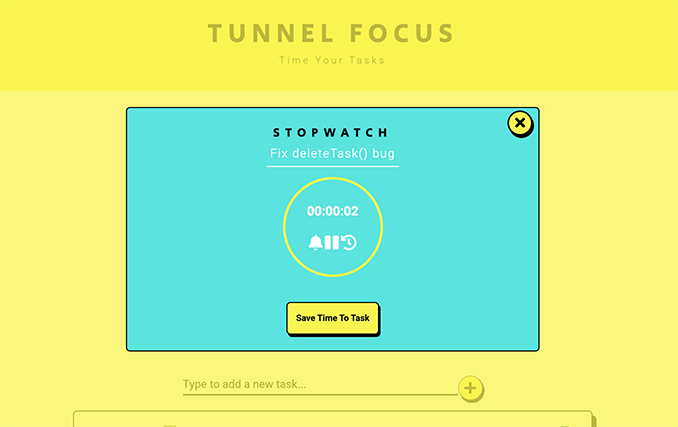
</p>

## 9. Productivity Charts

### Chart Design

The charts were designed to scroll down to, more to show a general comparison between time spent on various tasks. As the specific amount of time spent on each task can be viewed on the main task list, the charts are meant to be comparative in nature. 

They are screen reader & keyboard friendly and the dropdown select options can be accessed using mouse or keyboard (space bar and down/up arrows).

### Chart Substance

1. Total Time Focused On Each Task
    - shows the total time the user has timed or logged (using the edit task option) on each task.
    - The time is recorded and stored in seconds, but displayed in long form in the format hrs, mins, secs.

2. Total Time Focused On Each Task Today
    - shows the time recorded on each task if that time was recorded on the date that it is being viewed on, or 'today'.

3. Tasks Completed
    - A list of all tasks checked off. 

4. Tasks Completed Today
    - A list of all tasks checked off, when the last completion tick was recorded on 'todays' date.
    - OR when a task has already been marked as completed, but then the user goes and records more time on that task 'today'. Logically, that task is then completed 'today'.

### Charts Special Features 

- Hovering the mouse over any of the donut slices brings up a tooltip that shows the task description & the time spent on that task.
- The legend truncates long and wordy task descriptions to the first 15 / 25 characters to ensure nice formatting whatever the device screen size.
- If the user checks off a task while viewing one of the completed task lists, the page will reload in order to update that information. (This is not ideal functionality and is listed as one of the 'issues' / elements where there is room for improvement), but it does have the effect of ensuring an accurate representation of the data.
- When you add a new task, a legend for that task is automatically created on the charts, even if there is no time recorded on that task. This aids in the comparative representation.

<p align="center">
  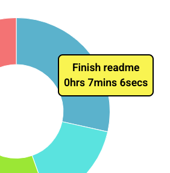
</p>

<p align="center">
  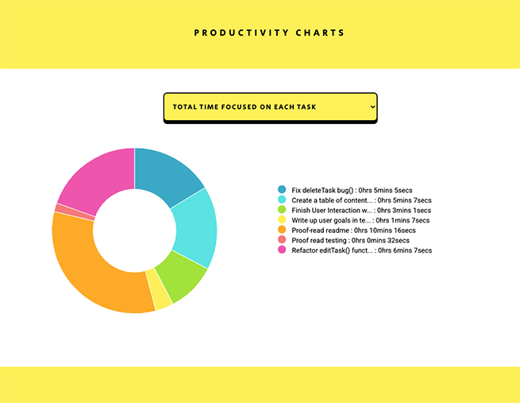
</p>


# Mobile-first Responsivity

This site was designed with a mobile-first approach in mind. As the bulk of the application takes place on a simple one page layout, and the interactions use modals, there were only a few subtle changes between breakpoints.  

## Mobile xs and sm breakpoints

- The **main task list** is centered in mobile and the feeling of space and minimalism is enhanced by the absence of any borders. 
- The **header** takes up a small amount of room. 
- Everything is easily accessible and easy to view. 
<p align="center">
  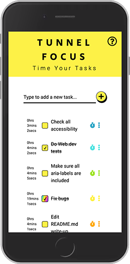
</p>

- The **charts** on mobile are stacked on top of the legend and they are styled so that they fit perfectly on the page.
<p align="center">
  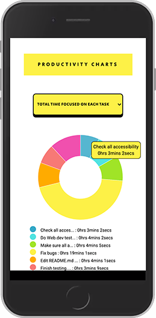
</p>

- The **completed task lists** are also centered and fit snugly on the page.
<p align="center">
  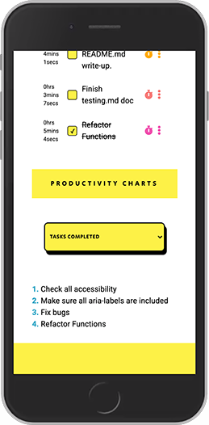
</p>

- The **timer** is centered and takes up 100% of the mobile width.
<p align="center">
  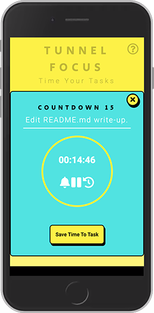
</p>

- The **editTask()** function is small and tidy on mobile in vertical orientation and takes up more space on landscape, but is the ideal size to edit and take in all the information. 

<p align="center">
  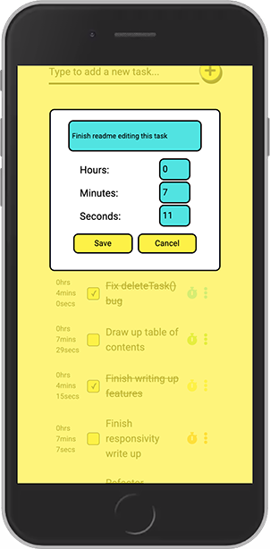
</p>

<p align="center">
  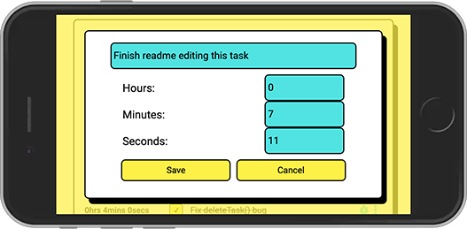
</p>

- The **modals** rise to the top of the mobile view and they sit on a darkened overlay.

<p align="center">
  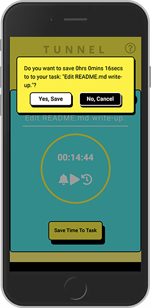
</p>

## iPads and md breakpoints

- The **main task list** is given a retro border on ipad & medium screens as there is sufficient space to accomodate that design choice comfortably.
- The task list takes up a smaller % ratio on the page and more of the application is visible at once.
<p align="center">
  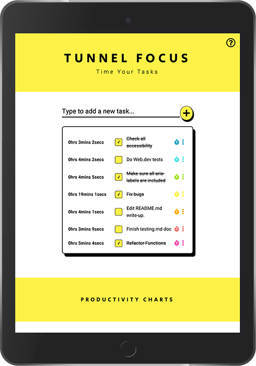
</p>

- On the iPad in vertical view the **charts** still stack over their legend. 
<p align="center">
  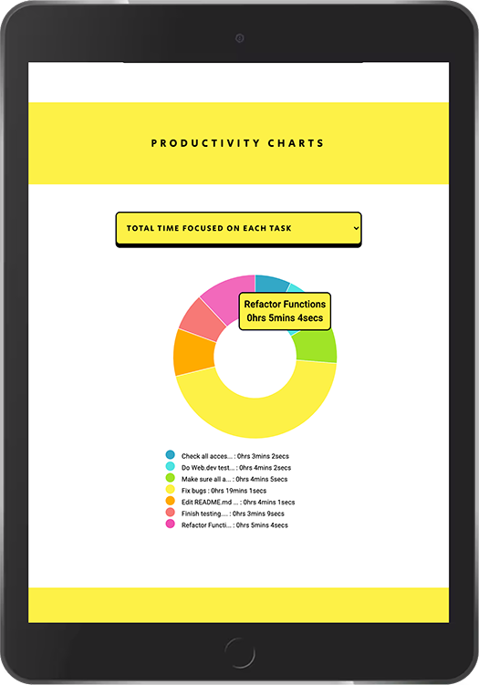
</p>

- However in landscape orientation they sit side by side as below:

<p align="center">
  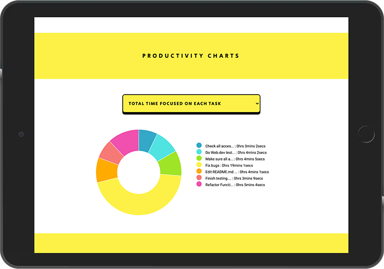
</p>

- **Completed tasks** are listed in the chart area and are centered in their div.
<p align="center">
  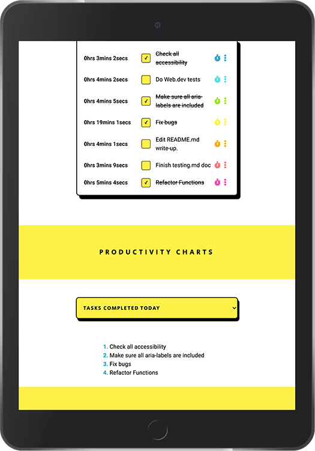
</p>

## Desktops lg and xl breakpoints

As illustrated below, the application on desktops and large screens has the same design and layout as on landscape medium screens, just with a little more white space and room to manoevre. 

The **charts** and their **legends** sit next to each other as on medium screens and landscape orientated iPad sized devices.

If I decide to implement some of the future release ideas, I will move the layout towards a more traditional dashboard layout on larger screen widths. So for instance, the charts might share their screen real estate with other features to their left and right. But for now, I like the feeling of space and clarity and ease of access that all the features have. 

<p align="center">
  
</p>

The **Edit task** modal has more space to stretch out on larger screens as below:

<p align="center">
  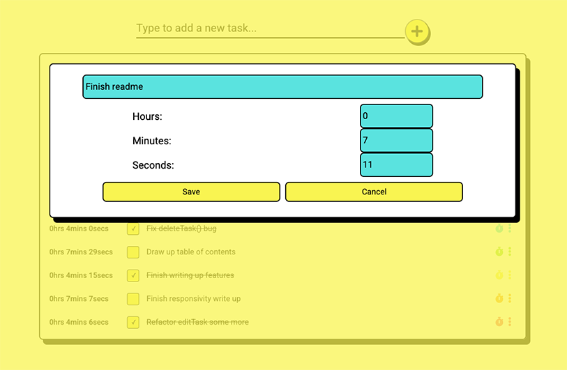
</p>


And finally, on large screens, the **Timer** has more space around it and centres itself on the page as below:

<p align="center">
  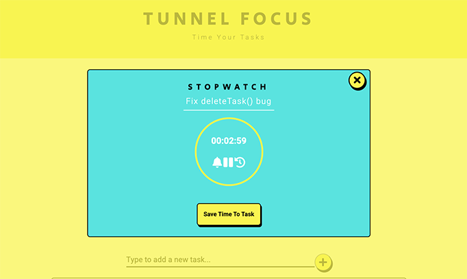
</p>


# Accessibility

Ensuring that the entire application is keyboard accessible was very important from the outset and each function and section of the application was coded with full keyboard functionality in mind. 

### 1. Event Listeners 
One particular roadblock I encountered when ensuring great keyboard accessibility was working out how to code behaviour based on two event listeners without having to duplicate large amounts of code.

I eventually found [this](https://stackoverflow.com/questions/11845678/adding-multiple-event-listeners-to-one-element) code online that helped me craft that functionality, which removed a huge amount of duplication. 

This got extra complex when I needed to nest two of these event arrays within each other in order to access items in the options menu popover. It eventually worked like this: 

            ellipsisArray.forEach(function(ellipsis){
            ['click','keyup'].forEach(function(evt){
                ellipsis.addEventListener(evt, function(elipEvent){
                    if((evt === 'click') || (elipEvent.keyCode === 9)) {
                        const countdown15Button = document.querySelector('.countdown15-task-option');
                        ['click','keyup'].forEach(function(e){
                            countdown15Button.addEventListener(e, function(event){
                                if((e === 'click') || (event.keyCode === 13)) { 
                                    REST OF LOGIC HERE }
While verbose and winding, this was definitely preferable to writing out the exact same logic twice, once for click events and once for keyup events. 

### 2. Skip Tasks 
Another issue I found when testing the application using only a keyboard was that it was infuriating when you had a long task list and you wanted to toggle charts, to have to tab through each individual task and all its associated options. To circumvent this issue, I included a "Skip Tasks" link that becomes visible only when the site is navigated using a keyboard.  

### 3. Screen Reader Accessibility 
Although not a perfect application, I used the Chrome Screen Reader to get an idea of how the website would be interacted with by screen reader users. The Chrome offering is nowhere near as complete, or accurate as more professional screen readers, however it did allow me to see where my application was falling down in terms of what elements were not labelled or semantically described correctly. Wherever possible, I fixed these issues by including aria-labels & titles to elements. I also redesigned many parts of the application to use buttons instead of ```<a>``` tags, as buttons are automatically described by screen readers and ```<a>``` tags are not. This was especially important for the task options & timer controls. 

### 4. Zoom Ratio
I ensured that the website was usable for those hard of vision by making sure that users can view and use it comfortably at up to 200% zoom as per web standards.

# Potential Features for Future Releases

1. Connecting to a database and creating user accounts with proper storage and retrieval of data. 
2. Connect up API for Google Calendar. 
3. Add due-dates to tasks. 
4. Adding project / category functionality. 
5. Wage calculations for people who are paid per hour/ on a time basis. Very useful for freelancers who operate by time expended.
6. Daily/weekly/monthly view of time spent working on each task/project. - Automated graphs with D3.js
7. Speech to text functionality for adding tasks to the list and making the application more accessible. 
8. Daily task time targets. So that the user can set a time goal on a task, and then work towards reaching it. 

# Testing

[Please click here to read all the testing documentation.](testing.md)


# Issues and Room For Improvement

1. I've realised over the course of building this application that the way I structured my event listeners (nestled inside object methods) was needlessly complex and led itself to some irritating bugs that needed fixes in the form of bind & unbind methods, and then eventually page reloads. I think for future projects I would separate out my classes from event listeners more definitively for this reason. 

2. To further the above point, I would also be tempted to move more towards a purely functional approach for my next project, as I believe that would make automated testing easier, as well as streamlining and uncomplicating the structure of the code. 

3. The donut chart hover effects are not keyboard friendly, and while that same information is available to view in the legend, I would ideally like every aspect of the website to be keyboard accessible. 


# Attribution

- ### **[Code to Convert Seconds into Hours, Minutes & Seconds](https://stackoverflow.com/questions/37096367/how-to-convert-seconds-to-minutes-and-hours-in-javascript)**
    Thank you to Wilson Lee on Stack Overflow for this solution.

- ### **[hideOnPopperBlur tippy.js Plugin](https://atomiks.github.io/tippyjs/v6/plugins/#hideonpopperblur)**
    I used this code to solve a keyboard accessibility issue referenced in testing. 

- ### **[Allan Nienhuis's Stack Overflow Solution to coding for two event listeners at once.](https://stackoverflow.com/questions/11845678/adding-multiple-event-listeners-to-one-element)**
    This was used to enable me to write behaviour for both click and keyup event listeners within the same code block. 

- ### **[Mikel Rychliski's Stack Overflow Solution to preventing negative numbers being allowed in inputs.](https://stackoverflow.com/questions/31575496/prevent-negative-inputs-in-form-input-type-number)**
    This was used in my manual task time edit function to stop people being able to input negative time. 

- ### **[Show data on mouse-over with d3.js](https://medium.com/@kj_schmidt/show-data-on-mouse-over-with-d3-js-3bf598ff8fc2)**
    My mouse over data display borrows *heavily* from this blog entry.

- ### **[Styling HTML Checkboxes Is Super Easy](https://dev.to/proticm/styling-html-checkboxes-is-super-easy-302o)**
    Used this code by Milos Protic to custom style my checkboxes. 

- ### **[Sum javascript object propertyA values with same object propertyB in array of objects](https://stackoverflow.com/questions/19233283/sum-javascript-object-propertya-values-with-same-object-propertyb-in-array-of-ob)**
    I used this code in its entirety (with one significant alteration) to merge objects by property values.

- ### **[Responsive D3.js](https://brendansudol.com/writing/responsive-d3)**
    I used this function to make my charts fully responsive. 

- ### **[Listening for a window width change](https://stackoverflow.com/questions/10750603/detect-a-window-width-change-but-not-a-height-change)**
    Used to detect if a user resized the window on a desktop/laptop.

- ### **[w3schools trim() method, specifically using their regex trim function](https://www.w3schools.com/jsref/jsref_trim_string.asp)**
    Used to solve an issue whereby a user could enter nothing as a task by hitting the spacebar a few times

- ### **[codingsoul's Stack Overflow solution to getting audio to play on mobile](https://stackoverflow.com/questions/45747427/playing-an-audio-sound-with-javascript-when-time-expires-is-not-working-on-andro)**
    Used to enable audio for the countdown timer alarms on mobile. 

- ### **[Stop iPhones From Zooming in on Form Fields](https://www.warrenchandler.com/2019/04/02/stop-iphones-from-zooming-in-on-form-fields/)**
    I used Warren Chandler's solution to fix this issue in my application. 

- ### **[Zac's CSS Only Rainbow Animation](https://codepen.io/zak/pen/rWJzPy)**
    Borrowed and altered this CSS code for the app's silent alarm. 

- ### **[How to focus in an input box on page load](https://stackoverflow.com/questions/4331022/focus-input-box-on-load)**
    Used to ensure that users did not have to hit tab or use the mouse each time they wanted to add new tasks.

- ### **[Regex to remove whitespace from an input ](https://stackoverflow.com/questions/49209362/what-is-the-meaning-of-s-s-gm-in-javascript#:~:text=The%20function%20call%20return%20x,replaced%20by%20empty%20string%20''%20.)**
    I used this in the addNewTask() method.
    
# Deployment

This website was developed using GitPod in a Chrome browser and commits were pushed to a GitHub repository. This site is currently hosted on GitHub pages.

## Publishing to GitHub Pages

1. I went to the main page of my GitHub repository.
2. I clicked on the "Settings" tab on the main horizontal tab bar.

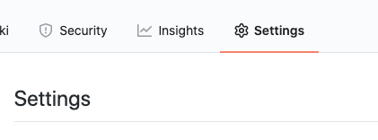


3. I scrolled down to the "GitHub Pages" section of settings.

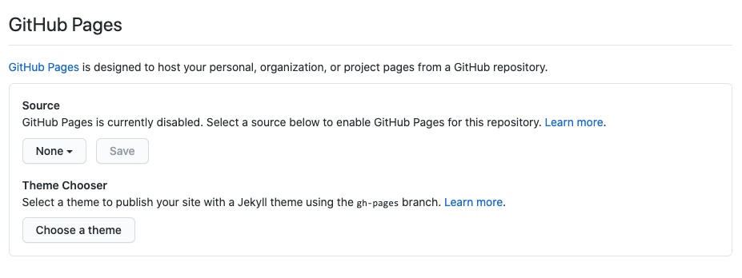

4. I selected "Branch: Master" and the "Root" Directory and then clicked "Save".

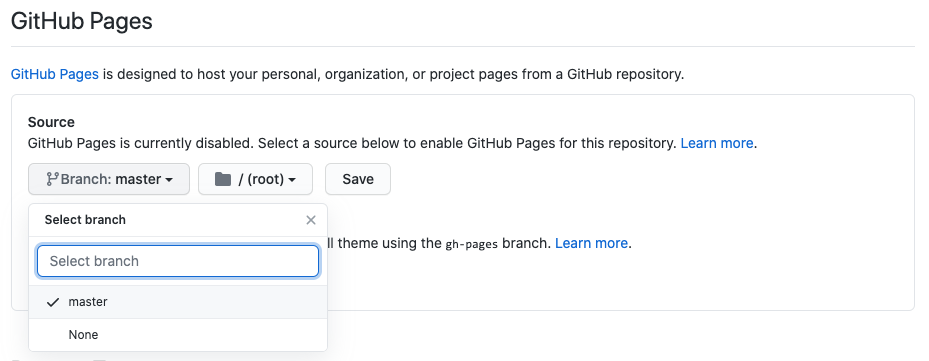

5. Site Published.

# Tools and Other Resources Used 

## 1. Design 

- ### **[Dribble](https://dribbble.com/)**

    Used for UX and design inspiration.

- ### **[Awwwards](https://www.awwwards.com/)**

    Used for design inspiration.

- ### **[Coolors](https://coolors.co/)**
    Used to select the colour palette for the project, as well as to generate the printed palette.

- ### **[Figma](https://www.figma.com/)**
    Used for wireframing and mock-ups

- ### **[Google Fonts]()**
    All fonts used are google fonts.

- ### **[Font Awesome](https://fontawesome.com/)**
    Most of the icons used are from Font Awesome.

- ### **[Are there devices narrower than 320px (and data on their usage for web browsing)?](https://ux.stackexchange.com/questions/74798/are-there-devices-narrower-than-320px-and-data-on-their-usage-for-web-browsing)**
    Information on responsive design re: smallest screen width to design for.

## 2. HTML and CSS

- ### **[CSS Tooltip](https://www.w3schools.com/css/css_tooltip.asp)**
    W3Schools information about using and writing CSS tooltips.

- ### **[CSS Cursor Property](https://www.w3schools.com/cssref/pr_class_cursor.asp)**
    W3Schools information about using the different cursors.

- ### **[Audio tag information](https://medium.com/better-programming/everything-about-the-audio-tag-in-html-and-javascript-c531d3bb882a)**
    Useful information about using the AUDIO tag.

- ### **[Autoprefixer](https://autoprefixer.github.io/)**
    Used to ensure cross-browser compatibility for my CSS code.

- ### **[Overriding button styles](https://css-tricks.com/overriding-default-button-styles/)**
    Used to transform ```<a>``` links into buttons and re-style them. 

## 3. JavaScript

- ### **[OOP in JavaScript: Made Super Simple](https://www.youtube.com/watch?v=PFmuCDHHpwk)**
    YouTube Tutorial by Mosh.

- ### **[JavaScript OOP Crash Course](https://www.youtube.com/watch?v=vDJpGenyHaA&feature=youtu.be)**
    Tutorial by Traversy Media

- ### **[Working with Objects - JavaScript](https://developer.mozilla.org/en-US/docs/Web/JavaScript/Guide/Working_with_Objects)**
    MDN JS Objects Overview.

- ### **[The find() method](https://developer.mozilla.org/en-US/docs/Web/JavaScript/Reference/Global_Objects/Array/find)**
    MDN information on the find() array method. 

- ### **[EveryThing You Need to Know About Local Storage](https://www.boldare.com/blog/everything-you-need-to-know-about-local-storage/)**
    Useful reference for how to use local storage.

- ### **[Local Storage Info](https://developer.mozilla.org/en-US/docs/Web/API/Window/localStorage)**
    MDN Local Storage reference. 

- ### **[Positioning popovers & tooltips](https://dev.to/atomiks/everything-i-know-about-positioning-poppers-tooltips-popovers-dropdowns-in-uis-3nkl)**
    An excellent reference and summary of the amount of factors you have to take into account when trying to position elements dynamically in the DOM.    

- ### **[Traversing the DOM with JavaScript](https://zellwk.com/blog/dom-traversals/)**
    A super useful article on DOM traversal with Vanilla JS.

- ### **[Information about Octal Literals](https://stackoverflow.com/questions/34358331/why-are-octal-numeric-literals-not-allowed-in-strict-mode-and-what-is-the-worka?lq=1)**
    A stack overflow discussion about Octal Literals and how to get around using them. 

- ### **[JSHint](https://jshint.com/)**
    A JavaScript code quality tool. I used it to check for errors in my code. 

- ### **[Unit Testing in JavaScript and Jasmine | TLDR Jasmine Unit Test Tutorial By: Dylan Israel](https://www.youtube.com/watch?v=h2eWfvcAOTI)**
    A great beginner's guide to Jasmine Testing.

- ### **[BDD Testing JavaScript with Jasmine](https://www.youtube.com/watch?v=BwXuu0gnIoE)**
    Fabulous video tutorial that goes into good detail into various Jasmine methods.

- ### **[clearInterval() Method](https://www.w3schools.com/jsref/met_win_clearinterval.asp)**
    w3schools clearInterval() information.

- ### **[Audio Object](https://www.w3schools.com/JSREF/dom_obj_audio.asp)**
    w3schools Audio Object information.

- ### **[JavaScript Refactoring](https://www.testim.io/blog/javascript-refactoring-5-plays-to-improve-code-quality/)**
    JavaScript Refactoring: 5 Plays to Improve Code Quality - By Testim

- ### **[Stack Overflow: how to mute audio in JS](https://stackoverflow.com/questions/39041960/how-to-unmute-html5-video-with-a-muted-prop)**
    Various responses to a question on muting and unmuting audio in JavaScript.

- ### **[How to Trigger a Button Click on Enter](https://www.w3schools.com/howto/howto_js_trigger_button_enter.asp)**
    w3schools information on triggering on keyup. Used for increasing keyboard accessibility.

- ### **[Solution to the interactive tippy.js keyboard issues](https://github.com/atomiks/tippyjs/issues/744#issuecomment-603631934)**
    Keyboard accessibility issue (referenced in testing.md file) with the default behaviour of the tippy.js popovers when used interactively by keyboard users. This plugin solution worked a treat.

- ### **[Information about removing event listeners using jQuery](https://stackoverflow.com/questions/209029/best-way-to-remove-an-event-handler-in-jquery)**
    Used to fix an infuriating bug on my manual time edit function. Referenced further in testing.md

- ### **[Working with timezones in JavaScript](https://stackoverflow.com/questions/15141762/how-to-initialize-a-javascript-date-to-a-particular-time-zone)**
    Information about UTC time and how to work with that. 

- ### **[Article about the spread operator](https://medium.com/swlh/the-need-to-know-how-to-use-spread-operator-in-javascript-54d3eccb92d6)**
    Used to solve a bug in the getTodayTasks() function (referenced in testing).

- ### **[To Locale Time String](https://www.w3schools.com/jsref/jsref_tolocaletimestring.asp)**
    Information on the toLocaleTimeString() Method from w3schools.

- ### **[Javascript scrollintoview smooth scroll and offset](https://stackoverflow.com/questions/49820013/javascript-scrollintoview-smooth-scroll-and-offset)**
    Information about using window.scrollTo & scrollIntoView()

- ### **[Make any chart responsive with one function](https://benclinkinbeard.com/d3tips/make-any-chart-responsive-with-one-function/?utm_content=buffer976d6&utm_medium=social&utm_source=twitter.com&utm_campaign=buffer)**
    The original source of information about how to make any D3.js chart responsive.

- ### **[How to prevent mobile devices from zooming in on elements](https://www.warrenchandler.com/2019/04/02/stop-iphones-from-zooming-in-on-form-fields/)**
    Information about the above was used to fix an annoying issue whereby the application would zoom in when a chart option was being selected, but would not zoom out automatically. 
    
## 4. D3.js 

- ### **[Let's learn D3.js](https://www.youtube.com/watch?v=C4t6qfHZ6Tw)**
    freeCodeCamp tutorial on D3. 

- ### **[D3.js Tutorials: Part 11 - Donut Charts](https://www.youtube.com/watch?v=0KB1tKCs7qE&list=PLEDbaVSIL58PGP65y3kkZse02s79BCbsp&index=12)**
    Great online series on D3.js
    
## 5. Git and GitHub

- ### **[How to Write a Git Commit Message - Chris Beams](https://chris.beams.io/posts/git-commit/)**
    Great post about writing commits for Git.

- ### **[Conventional Commits](https://www.conventionalcommits.org/en/v1.0.0/)**
    More specifications about commits.

- ### **[Working with Branches in Git and GitHub](https://thenewstack.io/dont-mess-with-the-master-working-with-branches-in-git-and-github/)**
    An introduction to branches. 

## 6. Frameworks

- ### **[tippy.js](https://atomiks.github.io/tippyjs/v6/getting-started/)**
    A wonderful JavaScript framework for tooltips, popovers, dropdowns & menus. Best thing since sliced bread.

## 7. General

- ### **[Debugging in Chrome](https://javascript.info/debugging-chrome)**
    Information about Chrome Debugging tools. 

- ### **[Can I Use](https://caniuse.com/)**
    Great for working out what features are workable on mobile devices and ensuring cross-browser compatibility. 

- ### **[How to Delete a Git Branch Both Locally and Remotely ](https://www.freecodecamp.org/news/how-to-delete-a-git-branch-both-locally-and-remotely/)**

- ### **[Tab Index Order](https://bitsofco.de/how-and-when-to-use-the-tabindex-attribute/)**

- ### **[DirtyMarkup Formatter](https://www.10bestdesign.com/dirtymarkup/)**
    Used to prettify my HTML, CSS & JS code.

- ### **[Chrome Screen Reader Extension](https://chrome.google.com/webstore/detail/screen-reader/kgejglhpjiefppelpmljglcjbhoiplfn/related)**
    Used to ensure great accessibility for users who rely on screen readers.

- ### **[Web Disability Simulator](https://chrome.google.com/webstore/detail/web-disability-simulator/olioanlbgbpmdlgjnnampnnlohigkjla?hl=en)**
    Super tool for testing your site for accessibility. Particular excellent for colourblindness testing.

- ### **[Accessibility Developer Guide](https://www.accessibility-developer-guide.com/introduction/)**
    One of the best guides to accessibility and ARIA that I've found.

# Technology Used

- HTML
- CSS
- JavaScript
- D3.js
- tippy.js 
- Git 
- GitHub
- GitPod

# Acknowledgements

Thanks to tutor Support specifically: 
- Haley who helped me crack a particularly stubborn bug in the Manual Time Edit Function and 
- Stephen who helped me extract elements of my deleteTask() function to the global space to fix an addEventListener issue.  

Thanks to the Code Institute Slack Community for their resources and information. <br>
Thank you to my Code Institute mentor [Oluwafemi Medale](https://github.com/omedale) for his invaluable insight and instruction. 