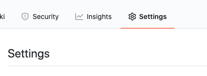
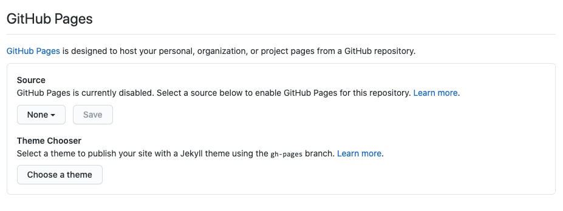
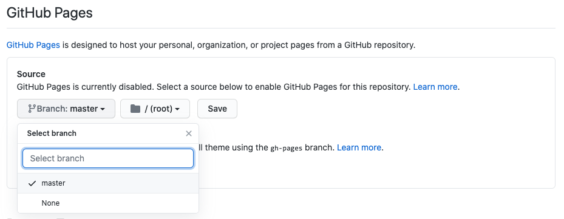

# Tunnel Focus: Time Your Tasks
## Code Institute Milestone Project 2: Interactive Front-End Development

Tunnel Focus is a browser based task manager with a difference. 
A key methodology of Agile Development is breaking large projects up into smaller tasks as a way to get things done efficiently. 

For many people focusing on a task "until it's done" is not the most efficient way to complete it, as your mind can wander and concentration can lag.
Focusing in small bursts and maintaining intense focus for small periods of time, punctuated by regular breaks can yield massive benefits in terms of work effiency.

This web application has been conceptualised and designed around that premise: small bursts of 
productivity which added together result in successfully completed tasks and projects. Tunnel Focus works as a simple task manager, except that it also keeps track of 
how long a user works on a particular task. As such it can be used to help with and encourage an Agile approach to development or any other area that requires task management.  

# UX

## User Stories 

The application is targeted at any user who requires a task manager for any purpose. It is particularly useful for anyone working on a large project with a lot of working parts.

### First Time User Stories

__*As a first time user:*__
- I want to be able to easily and clearly understand the purpose of this web application.
- I want to be able to quickly and easily understand how to navigate the application. 
- I want the application to be visually appealing and have a clean interface that is easy to view.

 __*As a user:*__
    
- I want to be able to add tasks to a list.
- I want to be able to edit a task.
- I want to be able to check off tasks when they are completed.
- I want to be able to delete a task.

- I want to be able to start the focus timer when I start working on a particular task.
- I want to be able to pause the focus timer if I take a break. 
- I want to be able to reset the focus timer for that particular segment of time, if for whatever reason I don't actually focus on work.

- I want to be able to start a countdown timer for work on a particular task.
- I want to be able to select whether the countdown timer runs for 15 or 25 minutes.
- When the countdown timer ends, I want to be alerted with an audio alarm and/or a visual display. 
- As a user with a small sleeping child, I want to have the option of turning off the audio alarm and relying on just 
a visual indication that the countdown is over.

- As a user, I want to be able to start an open-ended timer for longer sessions working on a particular task.
- I want to be alerted after every 30 minutes working with the open-ended timer.
- If I forget that the open-ended timer is running, I want to be able to delete that segment of time and not have it added to the total
time spent focused on that task.  

- I want to know how much time I have spent on each task today.
- I want to know how much time I have spent on each task overall. 
- I want to know how much time I have spent focused and working today.
- I would like to see this information displayed in pleasing and easy to comprehend charts and visuals.
- I would like to see a list of what tasks I completed today.

### Returning User Stories

__*As a returning user:*__ 
- I want my tasks to be stored and recalled when I navigate to the webpage.
- I want all the specifics associated with the tasks to be loaded correctly and accurately.

### Accessibility User Stories

- As a user who is __*hard of hearing*__, I want there to be a visual display when the countdown timer ends. 
- As a user who is __*colourblind*__, I want the colours used to employ sufficient contrast so that any visual cues are apparent to me.
- As a user who is __*physically impaired*__ I want to be able to use the keyboard to navigate and interact with the application. 

## Strategy

### __*Project Goals*__
- Create a time based task manager for project development 
- Create a simple product that can be used in the browser and with local storage.
- Create a product that is intuitive and useful for anyone working on a particular set of tasks. 
- Create a product that is scalable and has potential to develop further into a fully blown application with database storage. 
- Create an application that has clean lines and is minimal in design. 
- Bright toned design, whites, light greys and an accent colour or two.
- Encourage the use of sprint methodology when working to complete tasks.

### __*Target Users*__
The target users are people working on a series of tasks and particularly people employing a sprint methodology for task completion. 

### __*Research*__
I researched other task managers online and found a number that have similar functionality, but all were behind paywalls. I could not find a free and simple
task manager with timer functionality

## Scope

The basis for this application's scope, was actually to create an app I wanted to use for my own projects. I've used a variety of task managers over the years, 
and have always reverted to just writing lists on paper, which I still believe is a powerful method for many reasons. 

However, the one functionality I always felt was lacking from your run-of-the-mill online todo list / task manager, was the ability to time tasks. The internet is replete with 
todo lists and pomodoro timers and I felt they are most useful when combined. 

So the basic and general scope for this project is:
- A todo list with timer functionality. 

To further define both the task list functionality and features for the timer and the task manager components, I began by sketching out exactly what I would like to use and then I
spoke to friends in various creative and professional industries to see what ideas they could contribute. A timer functionality is most attractive to users who work on a varied list of projects 
that can be broken into smaller tasks. Because I got back such a wide variety of feature requests I sketched out the feature list chart displayed below to help me decide on what to include.

#|Opportunity/Potential Feature | Importance | Viability | Score
---|------------ | -------------|--------------|------------------
. | __*TASK LIST FUNCTIONALITY & FEATURES*__ 
1.| Add tasks to the task List  | 5 | 5 | 10
2.| Edit tasks | 5 | 5 | 10
3.| Delete tasks | 5 | 5 | 10
4.| Check tasks as completed | 5 | 5 | 10
5.| Add multiple task lists for different categories of tasks / different projects |2 | 3 | 5
6.| Add due-dates for tasks |2 | 4 | 6
7.| Sync task lists to Google Calendar API |2 | 2 | 4
8.| Speech to text functionality for adding tasks to lists |2 | 2 | 4
. | __*TASK TIMER FUNCTIONALITY & FEATURES*__ 
1.| Pomodoro style timer of 25 minutes |3 | 5 | 8
2.| Pomodoro style timer of 15 minutes |2 | 5 | 7
3.| Pomodoro style break time segments |1 | 3 | 4
4.| Allow users to select their own Pomodoro time length |2 | 3 | 5
5.| Stopwatch open-ended timer |4 | 5 | 9
6.| Focus Reminder Beeps / Pop-up messages |2 | 3 | 5
. | __*TASK CHARTS FUNCTIONALITY & FEATURES*__ 
1.| A display showing the total time focused "today" |4 | 4 | 8
2.| A display showing the total time focused overall |2 | 4 | 6
3.| A Chart showing the time focused on each task "today" |4 | 4 | 8
4.| A Chart showing the time focused on each task overall |3 | 4 | 7
5.| A Chart showing the amount of time segments per task and their times |2 | 2 | 4
6.| Weekly and monthly charts of time spent per task |2 | 2 | 4
7.| A list of tasks completed today |3 | 5 | 8
8.| A list of tasks completed overall |2 | 5 | 7
. | __*OTHER FUNCTIONALITY & FEATURES*__ 
1.| Randomly selected affirmations/quotes about work that appear when the timer is on |2 | 3 | 5
2.| Wage calculations for users who work by the hour/time period |1 | 2 | 3
3.| Display weather for the day at the top of the screen |1 | 3 | 4
 

## Structure

### Application Sections

- I have designed this as a relatively simple application with 1 view on desktop screens and two main views on medium and mobile screens.

__*Mobile & Medium Screens*__ 

- The list is featured first on the landing page and underneath it the daily task time chart is visible when the user scrolls down.
- Above that chart there is a drop-down arrow that links to the other chart that illustrates the total time spent on each of the tasks.
- When a user clicks to start the timer, it opens in a new window that displays just the timer. I vacillated between this design and making the timer
smaller to fit on the page with the task list as it is on larger screens, but I liked the simplicity of this for mobile, as the whole raison d'etre of the application is to focus on one task at a time, thus the user should not need to see anything else on their mobile screen when they are focusing on the task being timed.

**View 1:**

__*Page top*__

1. Header and application heading.
2. The task list.
3. The daily task time summary chart, starting at 0:00AM. (With a dropdown menu link to load the other summaries)*
4. Footer.

* These are links to subviews which will open in this location on the page, but replace the other charts. Only one chart or summary will be displayed at a time. 

**View 2:**

1. The timer. This will open based on the task that triggered it. It will have the name of the task above the time displayed. There will be an X to close the page and save the time to the task object. 

**Sub-Views**
These replace view1-item3 (the chart under the task list). They are all contained in the drop-down menu.

1. The summary chart of the total time spent per task.
2. A list of tasks completed that day.
3. A list of all the tasks completed.

__*Desktop*__

**View 1:**

__*Page top*__
1. Header and application title.
2. The timer (only when clicked on).
3. The task list
4. The task charts and task completion summaries laid out side by side, dashboard style.
5. Footer

- When the user clicks to start any of the timers, the timer will appear above the task list. 
- When the user clicks to close the timer, the user will be asked whether or not to save the time into the task. This is designed as such to avoid situations whereby the user hits the timer accidentally, or starts the timer and then gets distracted and doesn't spend the time on the task.  

- The desktop/large screens UI structure is based on the idea of a dashboard layout, but instead of filling all the white space as is customary with dashboards, I wanted to keep the task list center stage, to re-emphasize the "Focus" aspect of the application. This strategy also ensures that the design remains clean and visually uncomplicated. 

### Website Flow

As I've just outlined, most of this application takes place on one main page, with the exception of the timer on mobile and ipad-sized screens which opens a separate view that covers the screen. The idea is that when a user starts the timer, they will be initiating a burst of productivity that does not require them to use their mobile phone or ipad. The only information available to them from the mobile should be the time spent on that particular task. 

For desktop, I thought that a separate page for the timer, would be unnecessary navigation, as the user will likely minimise the page anyway, while they work on the task at hand. 

The flow is very much focused around the task list and the timer. The charts are a point of interest and reference, but they are scrolled down to, as they need not take center stage. 

### Interaction Design
### Information Architecture

## Skeleton

- On desktop - hierarchical tree structure top to bottom. 
- On mobile more of a new page experience - spoke and hub. Timer opens a new frame / window. As do charts. 
- This was for display purposes as well. - Too hard to view everything in the one window and unlike a typical website, the application does not espouse 
a scrolling interaction. It is more functional, therefore when you click on a timer, the timer functionality must appear. It would not be ok to have to scroll or look
for the timer. 

[My full Figma workspace for this project can be viewed here](https://www.figma.com/file/3LBKUPc79uP1qAKMfSBXKs/Wireframes1?node-id=0%3A1)

__*Alternatively here are the individual wireframes in pdf format:*__

If you choose to view them this way, please click download as the GitHub viewer expands the smaller wireframes to an uncomfortably large zoom ratio.

## Surface
- Typography - Clean sans-serif
- Design puts list front and center and because there are a number of elements in play, I want to keep it as minimal as possible, to avoid
overwhelming the user with colour and charts. 

# Features

- If you write your task in without capitalizing the first letter, it does that for you.
- Affirmations API is fed in under Timer. 
- A chart to show how long you spent on each task in the past 24hours.
- A chart to show the full length of time spent on each task.
- A list of all completed tasks. 

# Accessibility

Ensuring that the entire application is keyboard accessible was very important from the outset and each function and section of the application was coded with full keyboard functionality in mind. 

One particular roadblock I encountered when doing so was working out how to code behaviour based on two event listeners without having to duplicate large amounts of code.

I eventually found [this](https://stackoverflow.com/questions/11845678/adding-multiple-event-listeners-to-one-element) code online that helped me craft that functionality, which removed a huge amount of duplication. 

This got extra complex when I needed to nest two of these event arrays within each other in order to access items in the options menu popover. It eventually worked like this: 

            ellipsisArray.forEach(function(ellipsis){
            ['click','keyup'].forEach(function(evt){
                ellipsis.addEventListener(evt, function(elipEvent){
                    if((evt === 'click') || (elipEvent.keyCode === 9)) {
                        const countdown15Button = document.querySelector('.countdown15-task-option');
                        ['click','keyup'].forEach(function(e){
                            countdown15Button.addEventListener(e, function(event){
                                if((e === 'click') || (event.keyCode === 13)) { 
                                    REST OF LOGIC HERE }
While verbose and winding, this was definitely preferable to writing out the exact same logic twice, once for click events and once for keyup events. 

# Future Release Features

1. Connecting to a database and creating user accounts with proper storage and retrieval of data. 
2. Connect up API for Google Calendar. 
3. Add due-dates to tasks. 
4. Adding project / category functionality. 
5. Wage calculations for people who are paid per hour/ on a time basis. Very useful for freelancers who operate by time expended.
6. Daily/weekly/monthly view of time spent working on each task/project. - Automated graphs with D3.js
7. Speech to text functionality for adding tasks to the list. 
# Testing

[Please click here to read all the testing documentation.](testing.md)

# Issues / Room For Improvement

# Attribution

- ### **[Code to Convert Seconds into Hours, Minutes & Seconds](https://stackoverflow.com/questions/37096367/how-to-convert-seconds-to-minutes-and-hours-in-javascript)**
    Thank you to Wilson Lee on Stack Overflow for this solution.

- ### **[hideOnPopperBlur tippy.js Plugin](https://atomiks.github.io/tippyjs/v6/plugins/#hideonpopperblur)**
    I used this code to solve a keyboard accessibility issue referenced in testing. 

- ### **[Allan Nienhuis's Stack Overflow Solution to coding for two event listeners at once.](https://stackoverflow.com/questions/11845678/adding-multiple-event-listeners-to-one-element)**
    This was used to enable me to write behaviour for both click and keyup event listeners within the same code block. 

- ### **[Mikel Rychliski's Stack Overflow Solution to preventing negative numbers being allowed in inputs.](https://stackoverflow.com/questions/31575496/prevent-negative-inputs-in-form-input-type-number)**
    This was used in my manual task time edit function to stop people being able to input negative time. 

- ### **[Show data on mouse-over with d3.js](https://medium.com/@kj_schmidt/show-data-on-mouse-over-with-d3-js-3bf598ff8fc2)**
    My mouse over data display borrows *heavily* from this blog entry.

- ### **[Styling HTML Checkboxes Is Super Easy](https://dev.to/proticm/styling-html-checkboxes-is-super-easy-302o)**
    Used this code by Milos Protic to custom style my checkboxes. 

    
# Deployment

This website was developed using GitPod in a Chrome browser and commits were pushed to a GitHub repository. This site is currently hosted on GitHub pages.

## How I Published to GitHub Pages:

1. I went to the main page of my GitHub repository.
2. I clicked on the "Settings" tab on the main horizontal tab bar.

3. I scrolled down to the "GitHub Pages" section of settings.

4. I selected "Branch: Master" and the "Root" Directory and then clicked "Save".

5. Site Published.

# Tools & Other Resources Used 

## 1. Design 

- ### **[Dribble](https://dribbble.com/)**

    Used for UX and design inspiration.

- ### **[Awwwards](https://www.awwwards.com/)**

    Used for design inspiration.

- ### **[Coolors](https://coolors.co/)**
    Used to select the colour palette for the project, as well as to generate the printed palette.

- ### **[Figma](https://www.figma.com/)**
    Used for wireframing and mock-ups

- ### **[Google Fonts]()**
    All fonts used are google fonts.

- ### **[Font Awesome]()**
    Most of the icons used are from Font Awesome.

## 2. HTML & CSS

- ### **[CSS Tooltip](https://www.w3schools.com/css/css_tooltip.asp)**
    W3Schools information about using and writing CSS tooltips.

- ### **[CSS Cursor Property](https://www.w3schools.com/cssref/pr_class_cursor.asp)**
    W3Schools information about using the different cursors.

## 3. JavaScript

- ### **[OOP in JavaScript: Made Super Simple](https://www.youtube.com/watch?v=PFmuCDHHpwk)**
    YouTube Tutorial by Mosh.

- ### **[JavaScript OOP Crash Course](https://www.youtube.com/watch?v=vDJpGenyHaA&feature=youtu.be)**
    Tutorial by Traversy Media

- ### **[Working with Objects - JavaScript](https://developer.mozilla.org/en-US/docs/Web/JavaScript/Guide/Working_with_Objects)**
    MDN JS Objects Overview.

- ### **[The find() method](https://developer.mozilla.org/en-US/docs/Web/JavaScript/Reference/Global_Objects/Array/find)**
    MDN information on the find() array method. 

- ### **[EveryThing You Need to Know About Local Storage](https://www.boldare.com/blog/everything-you-need-to-know-about-local-storage/)**
    Useful reference for how to use local storage.

- ### **[Local Storage Info](https://developer.mozilla.org/en-US/docs/Web/API/Window/localStorage)**
    MDN Local Storage reference. 

- ### **[Positioning popovers & tooltips](https://dev.to/atomiks/everything-i-know-about-positioning-poppers-tooltips-popovers-dropdowns-in-uis-3nkl)**
    An excellent reference and summary of the amount of factors you have to take into account when trying to position elements dynamically in the DOM.    

- ### **[Traversing the DOM with JavaScript](https://zellwk.com/blog/dom-traversals/)**
    A super useful article on DOM traversal with Vanilla JS.

- ### **[Information about Octal Literals](https://stackoverflow.com/questions/34358331/why-are-octal-numeric-literals-not-allowed-in-strict-mode-and-what-is-the-worka?lq=1)**
    A stack overflow discussion about Octal Literals and how to get around using them. 

- ### **[JSHint](https://jshint.com/)**
    A JavaScript code quality tool. I used it to check for errors in my code. 

- ### **[Unit Testing in JavaScript and Jasmine | TLDR Jasmine Unit Test Tutorial By: Dylan Israel](https://www.youtube.com/watch?v=h2eWfvcAOTI)**
    A great beginner's guide to Jasmine Testing.

- ### **[BDD Testing JavaScript with Jasmine](https://www.youtube.com/watch?v=BwXuu0gnIoE)**
    Fabulous video tutorial that goes into good detail into various Jasmine methods.

- ### **[clearInterval() Method](https://www.w3schools.com/jsref/met_win_clearinterval.asp)**
    w3schools clearInterval() information.

- ### **[Audio Object](https://www.w3schools.com/JSREF/dom_obj_audio.asp)**
    w3schools Audio Object information.

- ### **[JavaScript Refactoring](https://www.testim.io/blog/javascript-refactoring-5-plays-to-improve-code-quality/)**
    JavaScript Refactoring: 5 Plays to Improve Code Quality - By Testim

- ### **[Stack Overflow: how to mute audio in JS](https://stackoverflow.com/questions/39041960/how-to-unmute-html5-video-with-a-muted-prop)**
    Various responses to a question on muting and unmuting audio in JavaScript.

- ### **[How to Trigger a Button Click on Enter](https://www.w3schools.com/howto/howto_js_trigger_button_enter.asp)**
    w3schools information on triggering on keyup. Used for increasing keyboard accessibility.

- ### **[Solution to the interactive tippy.js keyboard issues](https://github.com/atomiks/tippyjs/issues/744#issuecomment-603631934)**
    Keyboard accessibility issue (referenced in testing.md file) with the default behaviour of the tippy.js popovers when used interactively by keyboard users. This plugin solution worked a treat.

- ### **[Information about removing event listeners using jQuery](https://stackoverflow.com/questions/209029/best-way-to-remove-an-event-handler-in-jquery)**

    Used to fix an infuriating bug on my manual time edit function. Referenced further in testing.md

## 4. D3.js 

- ### **[Let's learn D3.js](https://www.youtube.com/watch?v=C4t6qfHZ6Tw)**
    freeCodeCamp tutorial on D3. 

- ### **[D3.js Tutorials: Part 11 - Donut Charts](https://www.youtube.com/watch?v=0KB1tKCs7qE&list=PLEDbaVSIL58PGP65y3kkZse02s79BCbsp&index=12)**
    Great online series on D3.js
    
## 4. General

- ### **[How to Write a Git Commit Message - Chris Beams](https://chris.beams.io/posts/git-commit/)**
    Great post about writing commits for Git.

- ### **[Conventional Commits](https://www.conventionalcommits.org/en/v1.0.0/)**
    More specifications about commits.

- ### **[Debugging in Chrome](https://javascript.info/debugging-chrome)**
    Information about Chrome Debugging tools. 

## 5. Frameworks

- ### **[tippy.js](https://atomiks.github.io/tippyjs/v6/getting-started/)**
    A wonderful JavaScript framework for tooltips, popovers, dropdowns & menus. Best thing since sliced bread.
# Technology Used

- HTML
- CSS
- JavaScript
- D3.js
- tippy.js 
- Git 
- GitHub
- GitPod

# Acknowledgements

Thanks To Haley from Tutor Support who helped me crack a particularly stubborn bug in the Manual Time Edit Function. 
Thanks to Igor from Tutor Support who gave me some great direction v-a-v Jasmine Testing. 