# **Tunnel Focus Testing**

# User Story Testing

//go through each user  

# Manual Testing

Continuous manual testing of all functions happened during development. Any time functionality was added or changed, I went through the entire application and tried to break it by doing all possible actions out of the normal logical flow of the application. This is how the majority of the bugs and issues were discovered. 

# Browser Testing

The application was tested on all major browsers with the exception of Internet Explorer, as its usage is so low and it is being retired early next year. 

# Application Logic / Structure

This task manager application is based on the principles of Object-Oriented Programming. Its logic is structured around 3 objects that interact: a Task object, a List object and a Timer object. 
In its incipient stages I had sketched out functionality based on a series of functions and event listeners and I saw how quickly that structure becomes unwieldly. The classes I have used compartmentalize the code and make it far easier to manage. I've noticed particularly how useful objects are for maintaining a clean global scope, with almost no variables.

# JavaScript

## Unit Testing with Jasmine
Unit testing with Jasmine for this project was nothing short of exasperating. As the project is Object Oriented, I found writing simple functional unit tests nearly impossible. I tried setting up an empty SpecRunner.html file as instructed in the Jasmine docs, but I could not get the tests to read the necessary html in order for them to run successfully. I then used Jasmine-jQuery to attempt to avail of fixtures, and while the fixtures did seem to render, the tests would only function if run against my complete page. Finally the only way I was able to avail of unit testing was to duplicate my rough draft html in SpecRunner.html and then to run appSpec.js against that. My reasoning being that I can run the unit tests in SpecRunner.html and still have a clean index.html to view and undertake the manual testing. This is undoubtedly not the correct way of doing things, but it was the only way I could find to integrate the testing into my project.

## **Timer Class**

## Timer.initialiseTimer():
This method is called on page load and all it does is ensure that we don't see "::" (as below) when the timer is called up for the first time. Instead it formats a nice row of 0s: 00:00:00

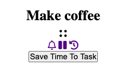


## Timer.timers():
This method encapsulates all the timer functions. It it not meant to be called on the object as a method per se, more it acts as a convenient storage facility for the group of functions that power the timers. 

### **Helper functions**
These are a series of functions that I've used to make the code more modular and easier to read by sectioning off code used more than once into smaller functions. 

- ## removeTimerFromDom()


__FUNCTION SUMMARY:__ This removes the timer from the DOM when the user is finished using it. It is called when a user saves a recently timed time to a task, or when a user presses the X button on the timer. 

- ## makeElementsNotKeyboardTabbable() & makeElementsKeyboardTabbableAgain()

__FUNCTION SUMMARY:__ These functions stop keyboard accessibility to a selection of elements. An addOverlay() function is used to stop users being able to click on elements when they are timing, or manually editing the time on a task. This works well for mouse users, but keyboard users were still able to tab and interact with various elements, hence the need for these two functions. 

- ## createTimerTitle()

__FUNCTION SUMMARY:__ This function was used because the steps it contains were repeated for each of the types of timers (countdown15, countdown25 and stopwatch). It adds the type of timer as a ```<h2>``` and it adds a type specific id that is used by various functions to identify which of the three timer types is being used. 

- ## formatTime()

__FUNCTION SUMMARY:__ This formats the time displayed by the timer into the 00:00:00 format. If the time in hours, minutes or seconds is less than 10 it adds a leading 0.

- ## resetCountdownHtml()

__FUNCTION SUMMARY:__ This resets the countdown timer display to either 15 or 25, it is different from the stopwatch reset, for obvious reasons. 

### **Timing functions**
These are a series of functions that take care of the timing logic. 

- ## countUp() 

    __FUNCTION SUMMARY:__ This function starts counting up from wherever the seconds, minutes and hours variables are at, be that 00:00:00 or after having been paused in the middle of a timing segment. When it is called, the seconds variable is incremented by 1, if the seconds variable is at 60, it is reset to 0. The same logic is applied to minutes. The hours variable increases ad infinitum. Three DOM variables are used to represent this logic in the DOM. This function is then called within a setInterval function within a function called StopWatchPlay() and it is called once every second, thus updating the timer.

    ### __*Issues encountered through testing*__

    __ISSUE 1:__ When creating my Timer object, I tried initialising the times to 00:00:00 and discovered that ```"Octal literals are not allowed in strict mode."``` 
    This refers to prefixing numbers with 0. 

    __FIX 1:__ I used template literals to add leading 0s for numbers less than 9. 

    __ISSUE 2:__ Even though I initialised the time properties to integers - when they are written dynamically in the DOM they are converted to strings. Here is an example of 
    one of the unanticipated side-effects of this:

    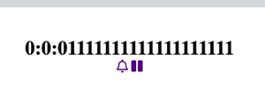

    __FIX 2:__ I found that for the purpose of this application it's fine that the html representation of time is in string form. The conversion  to strings is automatic, 
    and when I work with the total time I will convert those strings back to numbers. To fix the multiplying 1s, I left the conversion from strings to numbers up to the browser.

    __ISSUE 3:__ The stopwatch timer was working perfectly for counting seconds, but when it got to 59 minutes & 59 seconds it then showed: 00:60:00 for a second before changing to 01:00:01.
    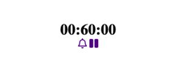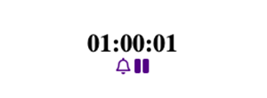

    __FIX:__ I had written an IF / ELSE IF statement for my timing logic:


            if(seconds >= 60){
                seconds = 0;
                minutes = minutes + 1;
            } else if(minutes >= 60){
                minutes = 0;
                hours = hours + 1;
            }

The ELSE IF was making it impossible for the seconds to be greater or equal to 60 at the same time as the minutes were greater or equal to 60. 
So the program was just running the seconds logic first and pushing them to 0 and only then running the minutes logic, at which point minutes were already at 60.


            if(seconds >= 60){
                seconds = 0;
                minutes = minutes + 1;
            } 
            if(minutes >= 60){
                minutes = 0;
                hours = hours + 1;
            }

Changing the code to two IF statements as above, fixed the issue.

- ## stopWatchPlay()

 __FUNCTION SUMMARY:__ Uses a setInterval to calls the countUp() function every second to update the time variables and the html time representation elements.

- ## countDown15Play() & countDown25Play()

__FUNCTION SUMMARY:__ These are the functions that call the interval timing functions (countdown() & countdown25SetInterval()) that work in concert to countdown from 15 & 25 minutes. When the seconds and minutes get to less than 0, the alarm plays, with or without sound, depending on the user's choice, and the countdownEnded() function is called.  

__ISSUE 1:__ As the seconds, minutes and hours are initialised to 0, I had difficulty arranging these functions so that minutes could initialise to 15 & 25. Initialising minutes within the countDown functions which are called by countdown() & countdown25SetInterval() every second, just kept the minutes at 15.

__FIX 1:__ I had to nest the functions within countDown15Play() & countDown25Play() in order to use *that* as the local scope in which to initialise minutes to 15 & 25 respectively. 


### **Structural functions**
These are the functions that take care of the foundations of the timing code. 

- ## stopWatchClickStart()

__FUNCTION SUMMARY:__ This is a click event listener on the stopwatch icons attached to each task in the task list. When clicked it starts the stopWatch timer *on that task* as long as certain conditions are met. The function is also responsible for taking the associated task description and playing it above the timer, so the user always has a reference of what task is being timed. This event listener also invokes stopWatchPause(), resetStopWatch() & playOnClick(stopWatchPlay) to access those functions from within its remit.

__ISSUE 1:__ There are two separate routes to starting the stopwatch timer. A user can click on the stopwatch icon (and this will always be the first method, as until they click here, the timer box will not be visible). Once the timer is visible, there are two ways to start the timer: the stopwatch icon *and* the play button that appears if the timer has is paused. This caused a bug that meant two or more Interval timers (based on the stopWatchPlay function) could be triggered to run at the same time. This causes the timer to increase the speed at which the seconds and minutes increase, and it ceased being a reliable timer. 

__FIX 1:__ The fix was to add a boolean variable called "playing" that I use anytime the timer is stopped or started. And then to add a small conditional in the stopwatch icon click event handler, that checks whether "playing" is false and if so, it is allowed trigger the stopwatch start function.  

                        if (!playing){
                            stopWatchPlay();
                        }
 __ISSUE 2:__ This bug was also triggered by the stopWatchPlayOnClick() function, as it could be called at the same time as stopWatchPlay(). 

 __FIX 2:__ I added the same conditional just before the function call to stopWatchPlay() within stopWatchPlayOnClick(): ```if(!playing){```

 __FIX 3:__ These issues and others were rendered obsolete when I included addOverlay() to the program, which effectively makes it impossible for a user to click on any other timer functions while the timer is running.

- ## countDown15ClickStart() & countDown25ClickStart()

__FUNCTION SUMMARY:__ These functions are click event listeners on the countdown timer icons in each task's popover menu box. When clicked the countdown timer is automatically started for 15 or 25 minutes. The countDownPlay(), pauseOnClick(), resetTime() & closeTimer() functions are available from within these functions. 

- ## playOnClick() 

__FUNCTION SUMMARY:__ Listens for the play button to be clicked and then I use the timer titles to determine which timer is sitting ready to be played. I then pass all associated necessary functions into the if/else if statement so that the correct countdown, pause and reset functions are available from within the playing state. When the play button is clicked this function also removes the play button and shows the pause one. 

- ## pauseOnClick(intervalToPause) 

__FUNCTION SUMMARY:__ Listens for clicks on the pause button and stops whichever interval timer is passed into the function.

- ## resetTime()

__FUNCTION SUMMARY:__ Listens for clicks on the reset button and clears whatever time interval function is passed into it. It also calls resetTimes() which resets all time variables to either 0, 15 minutes or 25 minutes, as well as stopping the timer. 

- ## resetTimes() 

__FUNCTION SUMMARY:__ Used in conjunction with resetStopWatch() to clear the time variables and reset the DOM timer representation as well. It uses the timer title to determine what number to reset the timers to. The countdown timer reset futher calls on resetCountdownHtml().

- ## countdownEnded() 

__FUNCTION SUMMARY:__ When either of the countdown timers reach 0 seconds and 0 minutes, this function is invoked. A modal pops up asking the user if they would like to save the full time to their task. If they click ok - it saves, otherwise it does not.

  __ISSUE 1:__ When left on another web page or minimised as the timer is running, the timer ticks over for some reason and starts into minus times, as illustrated below: 

 __FIX 1:__ ??? 

- ## closeTimer() 

__FUNCTION SUMMARY:__ This closes down the timer and removes it from sight when the X button is clicked. 

__ISSUE 1:__ If the user clicks the close button and the timer was in the middle of timing, the time would continue adding up. 

 __FIX 1:__ I instituted an if/else if statement that would pause the particular interval being used before the timer container is removed from the DOM.


- ## saveTimeButton() & saveTimeToTask()
    __FUNCTION(S) SUMMARY:__ The saveTimeButton first listens for a click event on the saveButton to save the currently timed time into two different task object properties as well as updating the time based elements in the DOM. 

    This function first checks whether or not time is 'playing' and if it is, it stops it. Then it hides the pause button and adds the play button. This was important because it is not unreasonable to think that a user might not pause the timer before deciding to save it. 

    An alert then asks whether the user is sure that they want to stop timing and save the time. If they confirm that they do, this function calls on the saveTimeToTask() function, passing in the id connected with the title of the task currently sitting in the timer seat. As the DOM ids are perfectly synced with the task ids - this allows me to pass that time data directly into the two task time properties: totalTimeFocusedOnTask & totalTimeFocusedOnTaskLongForm. It uses a Timer method: Timer.convertSecondsToTime to create the data that goes into the totalTimeFocusedOnTaskLongForm property.

    The saveTimeToTask() function then saves those changes to localStorage. And the saveTimeButton() function goes on to change the DOM time elements with updated task time data. 

    The saveTimeToTask function also performs different time saving calculations depending on which timer is being used. For the timers it minuses the full amount of time passed in seconds from either 900 or 1500, otherwise it calculates the stopwatch time in seconds. 

    When it has determined the amount of time in seconds to add to the task, it then uses timer.convertSecondsToTime to convert that to a long form time that is stored on the task object and displayed before each task in the task list. 

- ## alarmToggle() 

__FUNCTION SUMMARY:__ This function changes the alarm icon on click and associated on/off classes.

- ## manualTaskTimeEdit() 

__FUNCTION SUMMARY:__ This function allows the user to manually input or completely alter the amount of time spent working on a particular task. It listens for clicks on its associated icon and then uses the long form time that is displayed next to the task and splits it up into its integer components, creating new inputs to display these for alteration. When the user is ready to save the new time input they can click on  the save button and the function translates the new time first to seconds to save on the task and then into the long form again to save to the task as well.  

- ## addOverlay() & removeOverlay(); 

__FUNCTION SUMMARY:__ This function appends a div with the class 'overlay' to the body of the page. This overlay sits on top of the page at z-index: 1000 effectively disabling the page contents. removeOverlay() reverses the function.

- ## Timer.convertSecondsToTime(seconds)

__FUNCTION SUMMARY:__ Takes in seconds and converts them into hours, minutes and seconds in a human readable format. The code was taken from a Stack Overflow question and is referenced in the attribution section of this README. 

__ISSUE 1:__ I could not call this method from within other functions in this class. timer.convertSecondsToTime would not work. I kept getting a ```"Uncaught ReferenceError: convertSecondsToTime is not defined"```

__FIX 1:__ I had instantiated a local variable called timer and used it to refer to the timer container in the DOM. So calling timer.convertSecondsToTime() when trying to refer to an instance of the Timer Object called timer, was not actually doing that and was indeed not defined. Changing the variable name to timerContainer fixed the issue. 

__ISSUE 2:__ The manual edit time function was working the first time you clicked or pressed enter on it, but then the second time it was running through the function fully and then running through it again, which was causing all sorts of issues. Below is how it worked on the first click (successfully displaying the elements it is meant to):

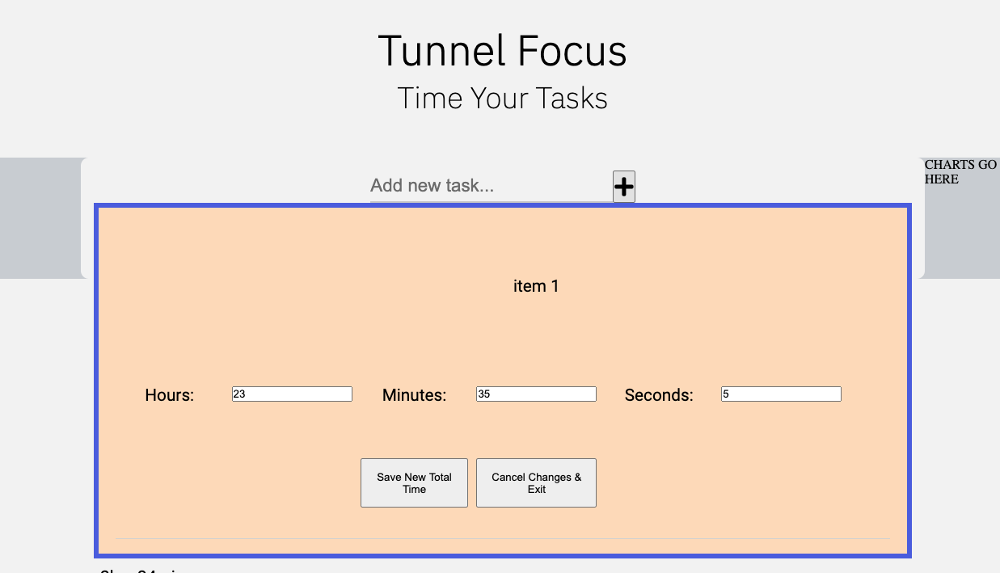

But this is what was happening on the second click without refreshing the page: 

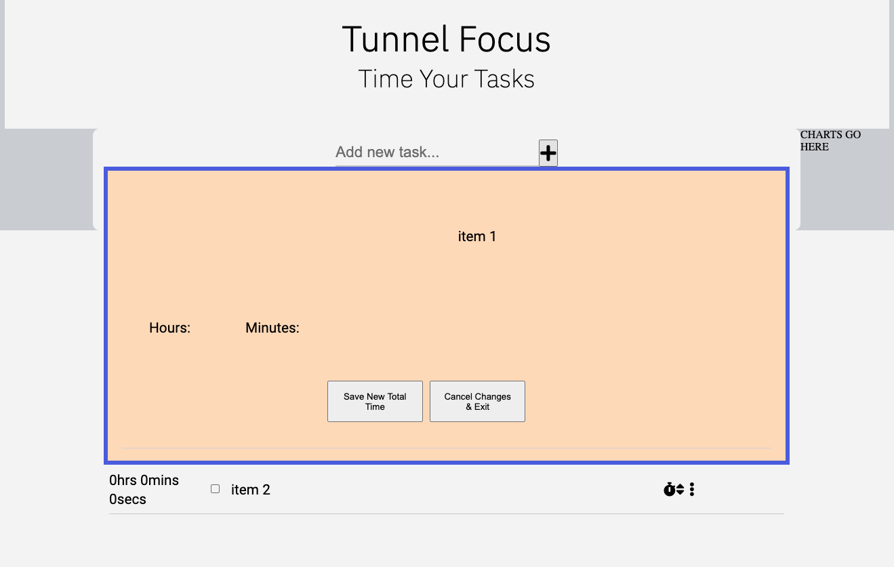

__FIX 2:__ The issue was that the click event handlers for the manual time edit button were adding up each time a user clicked on the button without refreshing the page. I eventually discovered this by examining the event listeners on that button at various stages of the function (as seen below): 

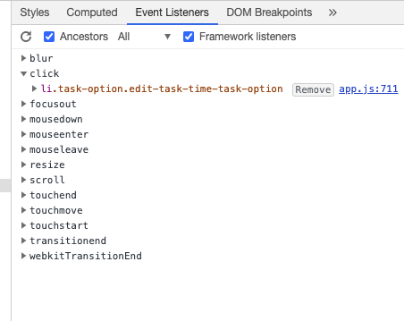
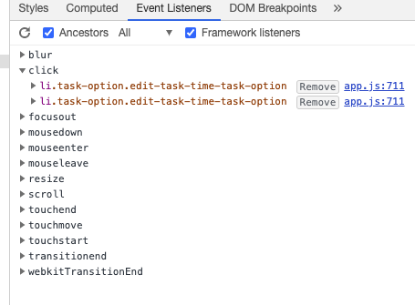

Then Haley from tutor support sent me [this](https://stackoverflow.com/questions/209029/best-way-to-remove-an-event-handler-in-jquery) useful information about using jQuery to effect a bind and unbind function on event listeners, in order to cancel or remove the event listeners of click and / or keyup. This worked a treat, as below:

                    $(this).unbind('click', arguments.callee);
                    $(this).unbind('keyup', arguments.callee);


__ISSUE 3:__ The new inputs created by the manualTaskTimeEdit() function allowed users to input negative numbers as time to add to a task. This is a logical impossibility, so I needed to find a way to make it impossible for a user to do this. 

__FIX 3:__ I found [this](https://stackoverflow.com/questions/31575496/prevent-negative-inputs-in-form-input-type-number) code on Stack Overflow which I added to the input construction as an attribute/value pair. 

__ISSUE 4:__ This worked for manual inputs of time, but users could still input negative numbers by using the down arrows in the number input section. 

__FIX 4:__ 

## Task Class

### *Properties*: 
- taskDescription (string)
- id (integer)
- completed (boolean)
- order (integer)
- totalTimeFocusedOnTask (integer)

### *Methods*:
- 
- 

## Task.addTimeToTask()
### __*Manual Testing*__

### __*Unit Testing*__


## List Class
### *Properties*: 
- taskList (array of objects)

### *Methods*:
- buildTaskList()
- addNewTask()
- toggleTaskComplete()
- editTask()
- deleteTask()
- dynamicPopoverNav()
- setDataToLocalStorage()


## List.buildTaskList()

__METHOD SUMMARY__: This method takes the tasks stored in local storage and writes them to the DOM for use. If there is nothing saved in local storage an empty array is returned from the Class definition and that is used. 
The method loops through each task stored in the taskList array and divides them into complete and incomplete tasks. 
### __*Manual Testing*__
__ISSUE 1:__ When writing tasks to the DOM, I needed to find a way to distinguish between completed and not completed tasks.

__FIX 1:__ Firstly I used the aforementioned if / else if conditional logic within the loop of tasks in the task array, dividing the html blocks into those with "checked" and those without.

__FIX 2:__ The other necessity to logging the completed tasks correctly was to call the toggleTaskComplete() method within buildTaskList()

### __*Unit Testing*__
## addNewTask()
__METHOD SUMMARY__: This method adds a new task to the DOM and also saves it into the taskList array as a Task Object. 
### __*Manual Testing*__
__ISSUE 1:__ Empty strings are being loggied as new tasks. I have conditional code saying ```if((newTaskInput !== null) && (newTaskInput !== "")){``` only then allow a new task 
to be created, and this works to a degree. If a user doesn't write anything and tries to add a task, they are blocked from doing so. However if they press the space bar a few times, 
a new empty string is added as a task. 

__FIX 1:__ -- As yet unfixed. 

__ISSUE 2:__ I needed to find a way to connect the Task Object in memory to the representation of the task in the DOM. 

__FIX 2:__ My first solution was to link the objects and DOM elements using the task descriptions. I figured that if I pushed the tasks into the array based on comparing what the user 
has entered as a task - then the task descriptions are always going to be identical, and I can therefore summon the task object using the html task and vice-versa.

__ISSUE 3:__ When manually testing this function, conjointly with the editTask() and deleteTask() functions, I discovered a massive flaw.  If a user writes in two identical tasks, and proceeds
to edit or delete one of them, the entire app would break as it would not be able to discern between the two and know which to delete or edit. 

__FIX 3:__ My solution was to change from using task descriptions to using ids. The Task object ids are set when they are initialised and they are based on the current length of the taskList array.
This way the ids will always run from 0 upwards and they will always match the id attributes of their html counterparts, which are set on the ```<li>``` task elements. This solution also led to a series
of bugs discussed [here](LINK TO delete() bugs).  


### __*Unit Testing*__

## editTask()

__METHOD SUMMARY__: This method takes the ```<li>``` that holds the task description and replaces it in the DOM with an input element that uses the li's task description attribute as it's value. The user can then edit the input and click on a save button to save the new task description.

### __*Manual Testing*__

__ISSUE 1:__ Once the user had clicked to "edit task" button, they were free to click on it again, as many times as they wanted which could lead to this situation:  

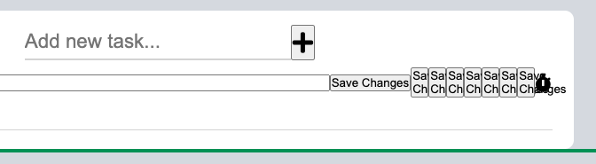

__FIX 1:__ I added a conditional that only allowed the edit method to be called if the save button was not already in the DOM: ```if (!document.querySelector('.save-button')){```

### __*Unit Testing*__

## 4. toggleTaskComplete()

__METHOD SUMMARY__:

### __*Manual Testing*__

### __*Unit Testing*__

## 5. deleteTask()
__METHOD SUMMARY__:

### __*Manual Testing*__

__ISSUE 1:__ When I changed the connection between Task objects and their html representations from the task descriptions to the task ids, it led to 
the following bug: when a user deletes a task, it is removed from the html and the taskList array. Therefore when a new task in instantiated based on 
the length of the taskList array, it is most likely that there will be two tasks with the same id number in the array. Again this would completely break the application.

__FIX 1:__ I fixed this by using two small for loops that run just after tasks are deleted. The first re-numbers the task object ids from 0 upwards: 
        
                        let tList = list.taskList;
        
                        for (let i=0; i<tList.length; i++){
                            tList[i].id = i;
                        }

And the second re-numbers the DOM tasks also from 0 upwards: 

                        let arrOfDomTasks = document.querySelectorAll('.task-description');
                        
                        for (let i=0; i<arrOfDomTasks.length; i++){
                        arrOfDomTasks[i].id = i.toString();
                        }

This way the html tasks and Task objects will always have the same ids and can therefore be connected seamlessly.

__ISSUE 2:__ This solution however, created another bug that behaved oddly. If a user loads a previously saved list from local storage, adds some tasks and then checks off some of the new tasks, and then 
adds another task, the checkmarks were disappearing on some of the newer additions. They still had a "checked" attribute when investigated and they still had the "complete" class assigned to them to draw the 
line through them, but the application was not registering the visual checkmark on the page. I debugged this using the Chrome JavaScript debugger, and the breakpoints pointed at the particular method causing the 
error. The addNewTask method calls the toggleTaskComplete() method when it finishes running, to ensure that checkmark capability is available for the new task added. The debugger pointed to the part of 
the toggleTaskComplete() method where it checks if the item is 'checked' and if it is to add the class "completed". For some reason, this is where the actual ticks in the checkboxes were being removed 
from the items. I found that adding: ```checkbox.setAttribute("checked", true)``` fixed the issue by explicitly forcing the "checked" attribute on all new task additions.


### __*Unit Testing*__

## 6. dynamicPopoverNav()
__METHOD SUMMARY__:
### __*Manual Testing*__

__ISSUE1:__ The popover. For my application's wireframed design to work, I needed to dynamically summon the navigation popover (containing edit, delete, timers etc...), on a specific task, as all the options
relate to a particular task. They are not general. I created an array of ellipsis icons that I iterated through and added an event listener for clicks. When any of the icons were clicked the popover would appear over the associated icon. 
I started by using getBoundingClientRect() as illustrated below. 

            const ellipsisArray = document.querySelectorAll('.task-options');
            const popover = document.getElementById('popover');

            ellipsisArray.forEach(icon=>{
                icon.addEventListener('click', function(event){
                    let ellipsis = event.target;
                    console.log(ellipsis.getBoundingClientRect());
                    popover.style.top = (ellipsis.getBoundingClientRect().y).toString()+"px";
                    popover.style.left = (ellipsis.getBoundingClientRect().x - 95).toString()+"px";

                    window.addEventListener('scroll', function(){
                        popover.style.top = (ellipsis.getBoundingClientRect().y).toString()+"px";
                        popover.style.left = (ellipsis.getBoundingClientRect().x - 95).toString()+"px";
                    })

                    popover.style.zIndex = "1";
                    
                })
            })
            if(popover.style.zIndex === "1"){
                !ellipsisArray.addEventListener('click', function(){
                    console.log("something else clicked.")
                })
            }

__FIX 1:__ I added an amount of px to the top and left of this, but that didn't work as the top and left values are dependent on page scroll. I.e. when I scrolled 
up the page, the location of the popover shifted dramatically. I needed to make it relative to the ellipsis itself **and** responsive to scroll events. I started 
playing around with the x & y offsets on the page, and then in an angry burst of stack overflowing, I happened upon tippy.js, which enabled me to implement the exact 
functionality I wanted in less than 15 minutes. Long live tippy.js

__ISSUE 2:__ While tippy.js is wonderful, I found that the keyboard accessibility would not automatically close the popover from the previous task before opening a new task item further down the list. This led to the following untidy situation, which would be quite irritating for keyboard users: 

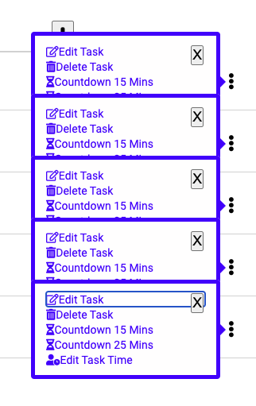

__FIX 2:__ As you can see above, I started trying to fix this issue by creating an X close button, that was clickable and keyboard tabbable, while this worked (sort of) using visibility and z-index, I then found a less hacky way in the closed issues on the developer's github repo using an object plugin that was actually in the documentation. The plugin is called hideOnPopperBlur and is attributed in the code and README.md file. 

__ISSUE 3:__ Another issue I found, was that when a user went to select an option from the popover options list, for example they click on "Edit Task", the popover did not disappear immediately, which is the functionality I believe makes the most sense. The tippy.js default is that it disappears when the user clicks anywhere else on the screen, but I felt that it should be hidden immediately to avoid this ugly situation: 

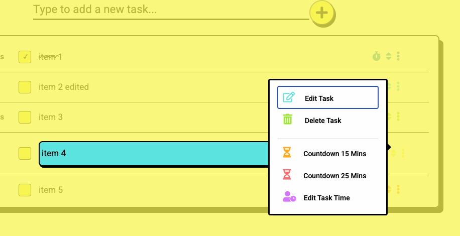

__FIX 3:__ I created my own tippy.js plugin to deal with this issue. ```hideOnOptionSelect``` It follows the recommended plugin formula for tippy.js and it includes an event listener for clicks on any of the popover options. Instead of looping through the array of popover options, I chose to create const variables for each of the four targeted options and then using || operators within my IF statement to outline the desired behaviour. This approach worked better within the parameters of the tippy.js plugin formula.  


### __*Unit Testing*__

## 7. setDataToLocalStorage()
__METHOD SUMMARY__: A short method to stringify the taskList array and save its data to localStorage. This method is called whenever the user changes or adds to their
tasks. 
### __*Manual Testing*__

- This actually required a good bit of testing and moving the method around to understand where and how it was saving the data. 

__ISSUE 1:__ Initially I had not realised that every time localStorage is set, it completely overwrites the previous save. I had initially set it to save after each individual 
task was created, which of course meant that there was only ever a single task saved. 

__FIX__ 1: I made sure that the method was placed so as to save the entire list each time localStorage is set.

### __*Unit Testing*__


getTodayTasks()

__FUNCTION SUMMARY:__ This function takes all the tasks in the taskList array of objects and then loops through each task's individual timeSegments array of objects and compares the timeSegment's local date to the current date at the time of calling the function. If the two dates are the same, i.e. if the task was saved 'today', then it pushes that timeSegment into a new array called todaysTasks. 

The function then loops through the todaysTasks array and pushes the tasks into a temporary object using their task Id as a key, and then it merges tasks with the same id and sums their timeToAdd values. The idea being that we will be left with a single amount of time spent on that task in the 'today' timespan. 

Another array is then created called todaysTasksFiltered and the properties in the temp object are looped through and pushed into that array, so as to have the structure of an array of objects which is need to create the associated d3.js chart.

__ISSUE 1:__ This function introduced me to the concept of 'passing by reference' for JavaScript objects. Initially the following code meant that for multiple timeSegments on a task, on a particular day, the first timeSegments value in the original task object was changing to the fully summed value as undertaken by this function. This meant that each time the total time spent on a task "today" was calculated the result was artifically inflated because the summed result of previous calculations was being added to genuine time segments. This bug is easier to show than explain: 

1. Three tasks are worked on "today" 
2. The first task is worked on, on 3 separate occasions for 4seconds, 3 seconds & 4 seconds. 
3. The other two tasks are just worked on once each. 
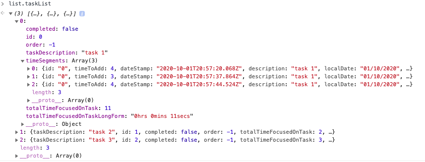

4. getTodayTasks() is called to create a chart. 
5. It successfully sums the first task into a single object displaying 11 seconds worked on the task. 

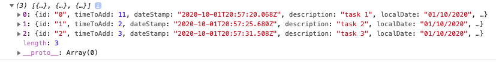
6. The user adds another task and works on it for a number of seconds. 
7. To update the chart, the user calls getTodayTasks again. 
8. But now the first task is registering as having 18seconds of total time worked on it. And if we look at the original task object, to our *horror* we see that the function has mutated the original time segment as well. 
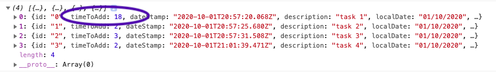
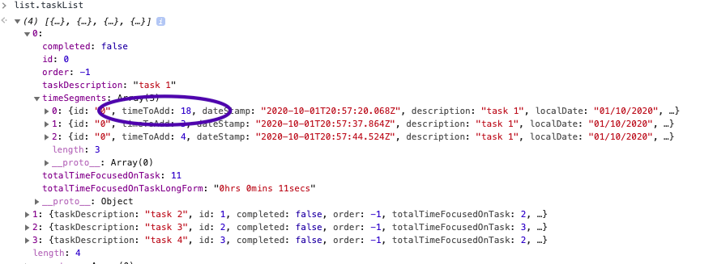

__FIX 1:__ The fix was just to add a spread operator at the point where the object first gets passed into the function:

            for(var i=0; i < todaysTasks.length; i++) {
                task = {...todaysTasks[i]}; 

This created a shallow copy of the original object, and thus left the original time segment alone, and stopped artificially inflating the task times. 
