# **Tunnel Focus Application: Testing**

# Testing Table Of Contents

* [User Story Testing](#user-story-testing)
  * [First Time User Goals](#first-time-user-goals)
  * [General User Goals](#general-user-goals)
  * [Returning User Goals](#returning-user-goals)
  * [Accessibility User Goals](#accessibility-user-goals)
      - [*Total Colourblindness Visual*](#total-colourblindness-visual)
      - [*Yellow-blue Colourblindness Visual*](#yellow-blue-colourblindness-visual)
      - [*Red-Green Colourblindness Visual*](#red-green-colourblindness-visual)
* [Manual Testing Approaches](#manual-testing-approaches)
* [Browser Testing](#browser-testing)
    - [Desktop Browser Testing](#desktop-browser-testing)
    - [Mobile Browser Testing](#mobile-browser-testing)
    - [A Note on Mobile Testing](#a-note-on-mobile-testing)
* [Application Structure](#application-structure)
* [JavaScript Testing](#javascript-testing)
    - [*Timer Class*](#timer-class)
        - [*Helper Functions*](#helper-functions)
        - [*Timing Functions*](#timing-functions)
        - [*Structural Functions*](#structural-functions)
    - [*Task Class*](#task-class)
    - [*List Class*](#list-class)
    - [*Productivity Chart Functions*](#productivity-chart-functions)
* [Code Validators](#code-validators)
    - [*HTML Validators*](#html-validators)
    - [*CSS Validators*](#css-validators)
    - [*JavaScript Validators*](#javascript-validators)
* [Web Development Tools Testing](#web-development-tools-testing)
    - [Lighthouse](#lighthouse)
    - [web dev Measure](#web-dev-measure)

# User Story Testing

## First Time User Goals

- **To be able to easily and clearly understand the purpose of this web application.**
    - The sub-heading provides a succint synopsis of the raison d'etre of the application.
    - The new task entry input also explicitly tells the user what is expected of them, and how to do it: "Type to add a new task..."
    - I've included a question-mark icon in the upper right-hand corner of the header that opens a modal that explains the application icons, and what their functions are more explicitly just in case a user is uncertain. 
- **To be able to quickly and easily understand how to navigate the application.**
    - When the user launches the application for the first time, all they see is the heading and the sub-heading and the suggestion of adding a new task. Once they do that they see the time summary associated with that task, a stopwatch icon & an ellipsis icon.
    - The icons avail of metaphorical thinking in that they clearly represent what they do. The only two icons without immediate further verbal explanations are the elipsis and the stopwatch.
        1. The elipsis is well established as leading to further options, therefore does not require further explanation.
        2. Since the sub-heading of the app, is "time your tasks" it is reasonable to expect the user to assume the stopwatch has something to do with timing their tasks. If they click it and discover that it counts upwards and they wanted to count downwards, they can easily cancel the operation and choose one of the countdown timers from the options menu.
    - All the menu options have icons & written explanations of what they do. 
    - As mentioned above I've also included further information about how everything works in detail in the information modal. 
- **For the application to be visually appealing and have a clean interface that is easy to view.**
    - I've designed the application with a bright clean faux retro interface that is easy to view and navigate. 
    - I've also used Chrome's Web Disability simulator to ensure that the application looks as good as possible for visually challenged users such as various manifestations of colour blindness.

## General User Goals

- **To be able to add tasks to a list.**
    - This is easily achieved by following the on-screen instructions using either a mouse or keyboard. 
- **To be able to edit a task.**
    - Intuitively achieved by selecting the "Edit Task" option from the menu options. Focus is specifically placed on the edit box using colour and an overlay that makes any other page interaction impossible. 
- **To be able to check off tasks when they are completed.**
    - The checkboxes are clearly visible on the page and they display rainbow colours and increase in size when hovered over.
- **To be able to delete a task.**
    - Easily achieved by selecting the delete task option from the the options menu.

- **To be able to start the focus timer when I start working on a particular task.**
    - The stopwatch icon is clearly visible on the main task line and when clicked a focus timer starts automatically.

- **To be able to pause the focus timer if I take a break.**
    - The pause button is clearly visible on the timer modal that appears when the timer is summoned. When the pause is clicked or selected, it disappears and the play button takes its place.
- **To be able to reset the focus timer for that particular segment of time, if for whatever reason I don't actually focus on work.**
    - The reset button is also clearly visible within the timer modal and when clicked it resets the timer to 00:00:00.

- **To be able to start a countdown timer for work on a particular task.**
- **To be able to select whether the countdown timer runs for 15 or 25 minutes.**
    - Both of the above are intuitively achieved by selecting either "Countdown 15 Mins" or "Countdown 25 Mins" from the options menu.
- **When the countdown timer ends, to be alerted with an audio alarm and/or a visual display.**
    - An audio alarm automatically plays as default on termination of the countdown period.
- **To have the option of turning off the audio alarm and relying on a visual indication that the countdown is over.**
    - If the alarm bell button is clicked, the alarm is muted and instead of an audio alarm, the screen displays a loop of changing colours, easily visible to peripheral vision.

- **To be able to start an open-ended timer for longer sessions working on a particular task.**
    - This is achieved by clicking the start stopwatch icon on the main task list. 

- **To be alerted after every 30 minutes working with the open-ended timer.**
    - When the stopwatch timer is playing, it beeps once every 30 minutes.

- **If a user forgets that the open-ended timer is running, to be able to delete that segment of time and not have it added to the total time spent focused on that task.**
    - A user can achieve this by either just not saving the time recorded to the task. Just by clicking the X close button and confirming that they don't wish to save that timed segment. 
    - They can also go to the "Edit Task" option and manually edit the amount of time that is saved to a particular task. 

- **To know how much time has been spent on each task today.**
    - This information is available in the productivity charts section, by selecting "Total Time Focused On Each Task Today"
- **To know how much time has been spent on each task overall.**
    - This information is available by selecting the productivity chart titled "Total Time Focused On Each Task".
- **To know how much time has been spent focused and working today.**
    - This feature was not implemented in this version of the application, but would be relatively easy to implement for a later release.
- **To see this information displayed in pleasing and easy to comprehend charts and visuals.**

    - The charts are easy to select, understand and view.

- **To see a list of what tasks I completed today.**
    - This is achieved by selecting "Tasks Completed Today" from the dropdown charts menu. 

## Returning User Goals

- **For tasks to be stored and recalled when I navigate to the webpage.**
    - This happens automatically using local storage and requires no user input.
- **For all the specifics associated with the tasks to be loaded correctly and accurately.**
    - Again this is automatic and works perfectly.

## Accessibility User Goals

- **As a user who is __*hard of hearing*__, there should be a visual display when the countdown timer ends.**
    - There is a colour-based mute alarm that alerts aurally challenged users to the end of the countdown. 
- **As a user who is __*colourblind*__, the colours used should employ sufficient contrast so that any visual cues are apparent to me.**
    - That was taken into account at the wireframing stage of design and rechecked using Chrome's Web Disability Simulator. Here are some of the very useful screenshot examples of how the application is viewed by colourblind users:

### Total Colourblindness Visual
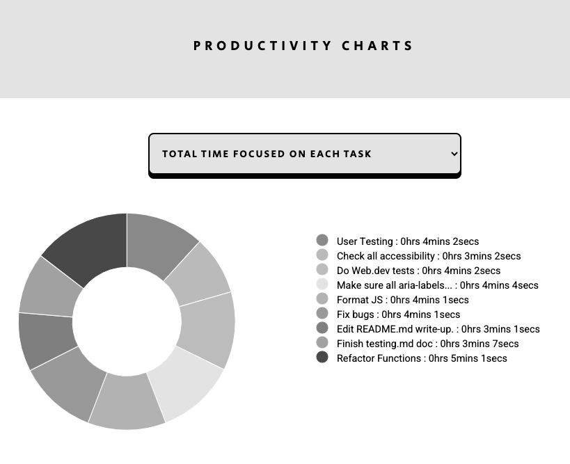

### Yellow-blue Colourblindness Visual
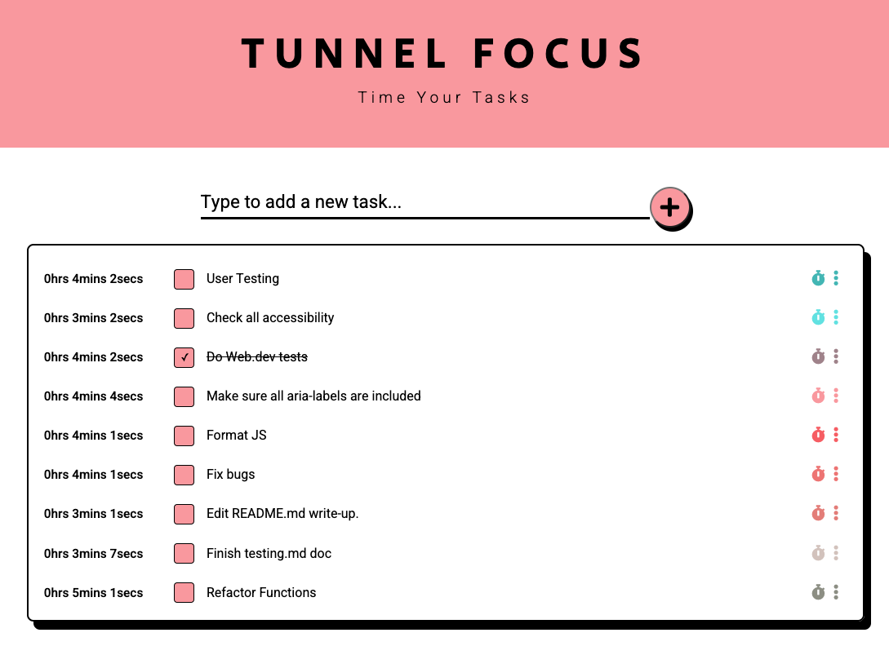

### Red-green Colourblindness Visual
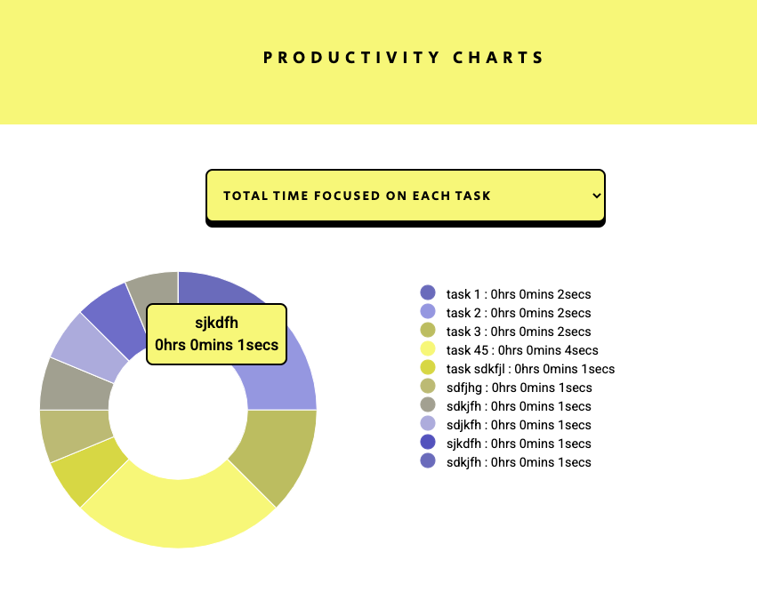

- Most pertinently none of the application interactions depend on the user being able to correctly discern between colours and the charts contain 2 different legends which I think sufficiently illustrates which tasks are associated with which donut slice.

- **As a user who is __*physically impaired*__: to be able to use the keyboard to navigate and fully interact with the application.**
    - The application is fully accessible for users who only use the keyboard. 
    - The tab-index of elements has been carefully managed to ensure maximum user experience in this arena.

- As a user who uses __*screen reader technology*__ the screen reader should be able to access all the controls and elements of the page and describe them to be correctly. 
    - Aria-labels have been added to all important elements that need to be read aloud to users. 
    - Elements have been semantically written so as to ensure the best possible experience for screen reader-dependent users. 

# Manual Testing Approaches

Continuous manual testing of all functions happened during development. Any time functionality was added or changed, I went through the entire application and tried to break it by doing all possible actions out of the normal logical flow of the application. This is how the majority of the bugs and issues were discovered in CSS, JavaScript & HTML.

- I tested the website layout at various breakpoints using Chrome Developer Tools, as well as the Responsive Viewer Chrome plugin, to make sure it looked good on all screen sizes. 

- I tested the application and all its functions on the selection of phones and iPads available in my home, as well as asking friends and family with different devices to test it on theirs.

- I did more robust browser & device testing using [Browser Stack](https://www.browserstack.com/) which is a super nifty application.

# Browser Testing

The application was tested on all major browsers with the exception of Internet Explorer, as its usage is so low and it is due to be completely retired early next year.

Here are the results of the browser testing using [Browser Stack](https://www.browserstack.com/)

## Desktop Browser Testing

| OS  | Browser | Version | Design Check | Functionality Check | 
| ---- | ------- | ------- | :---: | :---: |
| **Windows 7, 8, 8.1 & 10**   | *Microsoft Edge*  |  87 (latest) | ✓ | ✓
|   |   | 86 | ✓ | ✓
|   |   | 85 | ✓ | ✓
|   |   | 84 | ✓ | ✓
|   |   | 83 | ✓ | ✓
|   |   | 82 | ✓ | ✓
|   |   | 81 | ✓ | ✓
|   |   | 80 | ✓ | ✓
| ↓  |  ↓ | 18 | X | X
| **Windows 7, 8, 8.1 & 10 &**  | *Firefox*  |  84 (latest)| ✓ | ✓
|  **Mac OSX Mavericks and Newer** |   | 83 | ✓ | ✓
|   |   | 82 | ✓ | ✓
|   |   | 81 | ✓ | ✓
|   |   | 80 | ✓ | ✓
|   |   | 79 | ✓ | ✓
|   |   | 78 | ✓ | ✓
| ↑  |  ↑  | 66 | ✓ | ✓
| ↓  |  ↓  | 65 | X | X
| **Windows 7, 8, 8.1 & 10 &**   | *Chrome*  |  87 (latest)
| **Mac OSX Mavericks and Newer**  |   | 86 | ✓ | ✓
|   |   | 85 | ✓ | ✓
|   |   | 84 | ✓ | ✓
|   |   | 83 | ✓ | ✓
|   |   | 82 | ✓ | ✓
|   |   | 81 | ✓ | ✓
|   |   | 80 | ✓ | ✓
| ↑ | ↑  | 61 | ✓ | ✓
| ↓ | ↓  | 60 | X | X
| **Windows 7, 8, 8.1 & 10 &**  | *Opera*  |  73 (latest) | ✓ | ✓
| **Mac OSX Mavericks and Newer**  |   | 72 | ✓ | ✓
|   |   | 71 | ✓ | ✓
|   |   | 68 | ✓ | ✓
|   |   | 67 | ✓ | ✓
|   |   | 66 | ✓ | ✓
|   |   | 65 | ✓ | ✓
|  ↑ |  ↑ | 48 | ✓ | ✓
|  ↓  |  ↓  | 47 | X | X

For Mac systems nothing older than OSX Mavericks could sucessfully run the application, and for Windows nothing older than Windows 7. 

- On Windows desktops it worked perfectly on all versions of Microsoft Edge from 80 upwards.
- On Windows & Mac desktops it worked on all versions of Firefox from v66 upwards.
- On Windows & Mac desktops it worked on all versions of Chrome from v61 upwards.
- On Windows & Mac desktops it worked on all versions of Opera from v48 upwards. 

## Mobile Browser Testing

| Mobile Device  | OS  | Browser | Design Check | Functionality Check | 
| ---- | ------- | ------- | :---: | :---: |
| **iPhone & iPad**   | 14  |  Safari & Chrome | ✓ | ✓
|   | 13  | Safari & Chrome | ✓ | ✓
|   | 12 | Safari & Chrome | ✓ | ✓
|   | 11  | Safari | ✓ | ✓
| ↓   | 10  | Safari | X | X
| ↓   | 11  | Chrome | X | X
| **Samsung Galaxy S20, S9, S8, S10+, S10e, S9+, S8+, S7, S6, S5, S4, A51, A11, A10, A8, Note 20 - Note3**  | *10, 9, 8, 7, 6, 5, 4.4, 4.3*  |  Chrome, Firefox, Samsung Internet & UC Browser| ✓ | ✓
|  **Google Pixel 5, 4, 3a, 3, 2, Pixel, PixelXL, Nexus6P, Nexus 6, 5, 9, 7** | 11, 10, 9, 8, 7.1, 7, 6, 5, 4.4, 5.1, 6  | Chrome, Firefox & UC Browser | ✓ | ✓
|  **OnePlus 8, 7T, 7, 6T** | 10, 9  | Chrome, Firefox & UC Browser | ✓ | ✓
|  **Moto G7 Play, Moto X 2nd Gen, Moto G 2nd Gen** | 9, 6, 5  | Chrome, Firefox & UC Browser | ✓ | ✓

As the above demonstrates there are issues running the application on Apple devices from versions 10 & 11 and older (depending on whether a user is using Safari or Chrome).

Androids are far more backwards compatible, and using Browser Stack I found zero incompatibility testing the devices and OSs listed above.

## A Note on Mobile Testing

A rather unpleasant surprise I had halfway through designing the application was that the Chrome Dev Tools mobile emulator is not that good at emulating mobiles. Many of the application's features that worked fine in the emulator did not work or worked badly on mobile. I was able to fix all of these, but it highlighted the difficulties inherent in designing for mobile without constantly pushing to GitHub, making the site live and checking how it really works.

In order to test accurately for mobile, I cloned my application into a separate gitHub app, and whenever I found a tough mobile bug that required multiple tiny commits and pushing the application live for each one, I used the cloned application. This way the commit history was not flooded with hundreds of useless commits that explained very little of the actual coding process. 

# Application Structure

This task manager application is based on the principles of Object-Oriented Programming. Its logic is structured around 3 objects that interact: a Task object, a List object and a Timer object. 

In its incipient stages I had sketched out functionality based on a series of functions and event listeners and I saw how quickly that structure becomes unwieldly. The classes I have used compartmentalize the code and make it far easier to manage. I've noticed particularly how useful objects are for maintaining a clean global scope, with almost no variables. However I think next time I will try a fully functional programming approach in order to compare the two and to make automatic testing more accessible.

# JavaScript Testing

This section will detail each of the classes, properties, methods & functions that this application is comprised of. I will summarise their purpose and how they work, and any issues that arose during testing will be outlined.

## **Timer Class**

### *Properties*: 
- seconds (integer)()
- minutes (integer)()
- hours (integer)

### *Methods*:
- initialiseTimer()
- timers()

### *Helper Functions*:
- removeTimerFromDom()
- createTimerTitle()
- formatTime()
- resetCountdownHtml()
- scrollElementIntoView()

### *Timing Functions*:
- countUp()
- stopWatchPlay()
- countDown15Play()
- countdown()
- countDownFunction()
- countDown25Play()
- countdown15TimeToAdd(hours, minutes, seconds)
- countdown25TimeToAdd(hours, minutes, seconds)
- stopwatchTimeToAdd(hours, minutes, seconds)

### *Structural Functions*:
- stopWatchClickStart()
- countdownClickStartHelper(countdownType, countdownNumber)
- countDown15ClickStart()
- countDown25ClickStart()
- playOnClick()
- pauseOnClick(intervalToPause)
- resetTime(intervalToReset)
- resetTimes()
- countdownEnded()
- closeTimer()
- saveTimeButton()
- saveTimeToTask(id, seconds)
- alarmToggle()
- editTask()
- convertSecondsToTime(seconds)
- addOverlay()
- removeOverlay()
- addSilentAlarm()
- removeSilentAlarm()
- makeElementsNotKeyboardTabbable()
- makeElementsKeyboardTabbableAgain()

## Timer.initialiseTimer():
This method is called on page load and all it does is ensure that we don't see "::" (as below) when the timer is called up for the first time. Instead it formats a nice row of 0s: 00:00:00

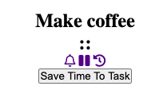


## Timer.timers():
This method encapsulates all the timer functions. It it not meant to be called on the object as a method per se, more it acts as a convenient storage facility for the group of functions that power the timers. 

## **Helper functions**
These are a series of functions that I've used to make the code more modular and easier to read by sectioning off code used more than once into smaller functions. 

- ## removeTimerFromDom()

__FUNCTION SUMMARY:__ This removes the timer from the DOM when the user is finished using it. It is called when a user saves a recently timed time to a task, or when a user presses the X button on the timer. 

- ## createTimerTitle()

__FUNCTION SUMMARY:__ This function was used because the steps it contains were repeated for each of the types of timers (countdown15, countdown25 and stopwatch). It adds the type of timer as a ```<h2>``` and it adds a type specific id that is used by various functions to identify which of the three timer types is being used. 

- ## formatTime()

__FUNCTION SUMMARY:__ This formats the time displayed by the timer into the 00:00:00 format. If the time in hours, minutes or seconds is less than 10 it adds a leading 0.

- ## resetCountdownHtml()

__FUNCTION SUMMARY:__ This resets the countdown timer display to either 15 or 25, it is different from the stopwatch reset, for obvious reasons. 

- ## scrollElementIntoView()

__FUNCTION SUMMARY:__ This scrolls the targeted element into view smoothly.


## **Timing functions**
These are a series of functions that take care of the timing logic. 

- ## countUp() 

    __FUNCTION SUMMARY:__ This function starts counting up from wherever the seconds, minutes and hours variables are at, be that 00:00:00 or after having been paused in the middle of a timing segment. When it is called, the seconds variable is incremented by 1, if the seconds variable is at 60, it is reset to 0. The same logic is applied to minutes. The hours variable increases ad infinitum. Three DOM variables are used to represent this logic in the DOM. This function is then called within a setInterval function within a function called StopWatchPlay() and it is called once every second, thus updating the timer.

    __ISSUE 1:__ When creating my Timer object, I tried initialising the times to 00:00:00 and discovered that ```"Octal literals are not allowed in strict mode."``` 
    This refers to prefixing numbers with 0. 

    __FIX 1:__ I used template literals to add leading 0s for numbers less than 9. 

    __ISSUE 2:__ Even though I initialised the time properties to integers - when they are written dynamically in the DOM they are converted to strings. Here is an example of 
    one of the unanticipated side-effects of this:

    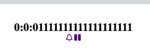

    __FIX 2:__ I found that for the purpose of this application it's fine that the html representation of time is in string form. The conversion  to strings is automatic, 
    and when I work with the total time I will convert those strings back to numbers. To fix the multiplying 1s, I left the conversion from strings to numbers up to the browser.

    __ISSUE 3:__ The stopwatch timer was working perfectly for counting seconds, but when it got to 59 minutes & 59 seconds it then showed: 00:60:00 for a second before changing to 01:00:01.
    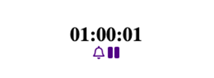

    __FIX:__ I had written an IF / ELSE IF statement for my timing logic:


            if(seconds >= 60){
                seconds = 0;
                minutes = minutes + 1;
            } else if(minutes >= 60){
                minutes = 0;
                hours = hours + 1;
            }

The ELSE IF was making it impossible for the seconds to be greater or equal to 60 at the same time as the minutes were greater or equal to 60. 
So the program was just running the seconds logic first and pushing them to 0 and only then running the minutes logic, at which point minutes were already at 60.


            if(seconds >= 60){
                seconds = 0;
                minutes = minutes + 1;
            } 
            if(minutes >= 60){
                minutes = 0;
                hours = hours + 1;
            }

Changing the code to two IF statements as above, fixed the issue.

- ## stopWatchPlay()

 __FUNCTION SUMMARY:__ Uses a setInterval to calls the countUp() function every second to update the time variables and the html time representation elements.

- ## countDown15Play() & countDown25Play()

__FUNCTION SUMMARY:__ These are the functions that call the interval timing functions (countdown() & countdown25SetInterval()) that work in concert to countdown from 15 & 25 minutes. When the seconds and minutes get to less than 0, the alarm plays, with or without sound, depending on the user's choice, and the countdownEnded() function is called.  

__ISSUE 1:__ As the seconds, minutes and hours are initialised to 0, I had difficulty arranging these functions so that minutes could initialise to 15 & 25. Initialising minutes within the countDown functions which are called by countdown() & countdown25SetInterval() every second, just kept the minutes at 15.

__FIX 1:__ I had to nest the functions within countDown15Play() & countDown25Play() in order to use *that* as the local scope in which to initialise minutes to 15 & 25 respectively. 

 ## countdown()

 __FUNCTION SUMMARY:__ This function runs the countDownFunction() every second.

## countDownFunction()

__FUNCTION SUMMARY:__ This is the actual countdown function that changes the timing variables every second and outlines the rules for when to alter the minutes (hours don't come into play as our two countdown timers only run for 15 and 25 minutes).

__ISSUE 1:__ When the countdown timers ended, the display kicked in when the seconds fall before :00 so the display would show 00:00:0-1 which was not a big deal, but I didn't like the way it looked. 

__FIX 1:__ I just set the ```seconds = 0, minutes = 0 & hours = 0;``` explicitly within the countdown() function before the countdownEnded() function is called, which was where this occured previously.

__ISSUE 2:__ The alarm sound doesn't play on mobile or ipad.

__FIX 2:__ It transpires that Chrome and Safari for Mobile don't allow audio to play unless a user has clicked on a button to play audio. It does however work on Firefox for mobile.   UNFIXED

- ## countdown15TimeToAdd(hours, minutes, seconds) & countdown25TimeToAdd(hours, minutes, seconds) & stopwatchTimeToAdd(hours, minutes, seconds)

__FUNCTION SUMMARY:__ These three functions calculate the amount of time to add to a particular task depending on which type of timer is used. The formula for doing so differs. 

## **Structural functions**
These are the functions that take care of the foundations of the timing code. 

- ## stopWatchClickStart()

__FUNCTION SUMMARY:__ This is a click event listener on the stopwatch icons attached to each task in the task list. When clicked it starts the stopWatch timer *on that task* as long as certain conditions are met. The function is also responsible for taking the associated task description and playing it above the timer, so the user always has a reference of what task is being timed. This event listener also invokes stopWatchPause(), resetStopWatch() & playOnClick(stopWatchPlay) to access those functions from within its remit.

__ISSUE 1:__ There are two separate routes to starting the stopwatch timer. A user can click on the stopwatch icon (and this will always be the first method, as until they click here, the timer box will not be visible). Once the timer is visible, there are two ways to start the timer: the stopwatch icon *and* the play button that appears if the timer has is paused. This caused a bug that meant two or more Interval timers (based on the stopWatchPlay function) could be triggered to run at the same time. This causes the timer to increase the speed at which the seconds and minutes increase, and it ceased being a reliable timer. 

__FIX 1:__ The fix was to add a boolean variable called "playing" that I use anytime the timer is stopped or started. And then to add a small conditional in the stopwatch icon click event handler, that checks whether "playing" is false and if so, it is allowed trigger the stopwatch start function.  

                        if (!playing){
                            stopWatchPlay();
                        }
 __ISSUE 2:__ This bug was also triggered by the stopWatchPlayOnClick() function, as it could be called at the same time as stopWatchPlay(). 

 __FIX 2:__ I added the same conditional just before the function call to stopWatchPlay() within stopWatchPlayOnClick(): ```if(!playing){```

 __FIX 3:__ These issues and others were rendered obsolete when I included addOverlay() to the program, which effectively makes it impossible for a user to click on any other timer functions while the timer is running.

- ## countdownClickStartHelper(countdownType, countdownNumber)

__FUNCTION SUMMARY:__ This function collates all elements and functions common to both countdownClickStart functions (detailed below) in one function in order to refactor code an save space.


- ## countDown15ClickStart() & countDown25ClickStart()

__FUNCTION SUMMARY:__ These functions are click event listeners on the countdown timer icons in each task's popover menu box. When clicked the countdown timer is automatically started for 15 or 25 minutes. The countDownPlay(), pauseOnClick(), resetTime() & closeTimer() functions are available from within these functions. 

- ## playOnClick() 

__FUNCTION SUMMARY:__ Listens for the play button to be clicked and then I use the timer titles to determine which timer is sitting ready to be played. I then pass all associated necessary functions into the if/else if statement so that the correct countdown, pause and reset functions are available from within the playing state. When the play button is clicked this function also removes the play button and shows the pause one. 

- ## pauseOnClick(intervalToPause) 

__FUNCTION SUMMARY:__ Listens for clicks on the pause button and stops whichever interval timer is passed into the function.

- ## resetTime()

__FUNCTION SUMMARY:__ Listens for clicks on the reset button and clears whatever time interval function is passed into it. It also calls resetTimes() which resets all time variables to either 0, 15 minutes or 25 minutes, as well as stopping the timer. 

- ## resetTimes() 

__FUNCTION SUMMARY:__ Used in conjunction with resetStopWatch() to clear the time variables and reset the DOM timer representation as well. It uses the timer title to determine what number to reset the timers to. The countdown timer reset futher calls on resetCountdownHtml().

- ## countdownEnded() 

__FUNCTION SUMMARY:__ When either of the countdown timers reach 0 seconds and 0 minutes, this function is invoked. A modal pops up asking the user if they would like to save the full time to their task. If they click ok - it saves, otherwise it does not.

  __ISSUE 1:__ When left on another web page or minimised as the timer is running, the timer ticks over for some reason and starts into minus times, as illustrated below: 

 __FIX 1:__ ??? 

 __ISSUE 2:__ When the countdown ends on a mobile device, the alarm did not play. 

 __FIX 2:__ This happens because to protect users from an aural onslaught, mobile browsers have specific rules about unsolicited audio playing, thus audio must be actively triggered by the user, to emulate that situation, I added:

                                    alarm.play()
                                    alarm.pause()
To both the countDown15ClickStart() & countDown25ClickStart() functions, as per information found on Stack Overflow. (attributed in readme)

- ## closeTimer() 

__FUNCTION SUMMARY:__ This closes down the timer and removes it from sight when the X button is clicked. 

__ISSUE 1:__ If the user clicks the close button and the timer was in the middle of timing, the time would continue adding up. 

 __FIX 1:__ I instituted an if/else if statement that would pause the particular interval being used before the timer container is removed from the DOM.

- ## saveTimeButton() & saveTimeToTask()
    
__FUNCTION(S) SUMMARY:__ The saveTimeButton first listens for a click event on the saveButton to save the currently timed time into two different task object properties as well as updating the time based elements in the DOM. 

This function first checks whether or not time is 'playing' and if it is, it stops it. Then it hides the pause button and adds the play button. This was important because it is not unreasonable to think that a user might not pause the timer before deciding to save it. 

An alert then asks whether the user is sure that they want to stop timing and save the time. If they confirm that they do, this function calls on the saveTimeToTask() function, passing in the id connected with the title of the task currently sitting in the timer seat. As the DOM ids are perfectly synced with the task ids - this allows me to pass that time data directly into the two task time properties: totalTimeFocusedOnTask & totalTimeFocusedOnTaskLongForm. It uses a Timer method: Timer.convertSecondsToTime to create the data that goes into the totalTimeFocusedOnTaskLongForm property.

The saveTimeToTask() function then saves those changes to localStorage. And the saveTimeButton() function goes on to change the DOM time elements with updated task time data. 

The saveTimeToTask function also calls upon the two countdown15TimeToAdd() & countdown25TimeToAdd() functions previously detailed to help it to add the correct amount of time to the associated task.

When it has determined the amount of time in seconds to add to the task, it then uses timer.convertSecondsToTime to convert that to a long form time that is stored on the task object and displayed before each task in the task list. 

- ## alarmToggle() 

__FUNCTION SUMMARY:__ This function changes the alarm icon on click and associated on/off classes.

- ## editTask() 
    ### *( originally manualTaskTimeEdit()  )*

__FUNCTION SUMMARY:__ This function allows the user to manually edit a task input or completely alter the amount of time spent working on a particular task. It listens for clicks on its associated icon and then uses the long form time that is displayed next to the task and splits it up into its integer components, creating new inputs to display these for alteration. When the user is ready to save the new time input they can click on the save button and the function translates the new time first to seconds to save on the task and then into the long form again to save to the task as well. Following a suggestion by my mentor I also merged my code from the editTask() function into this one to have just one edit method. 

__ISSUE 1:__ The manual edit time function was working the first time you clicked or pressed enter on it, but then the second time it was running through the function fully and then running through it again, which was causing all sorts of issues. Below is how it worked on the first click (successfully displaying the elements it is meant to):

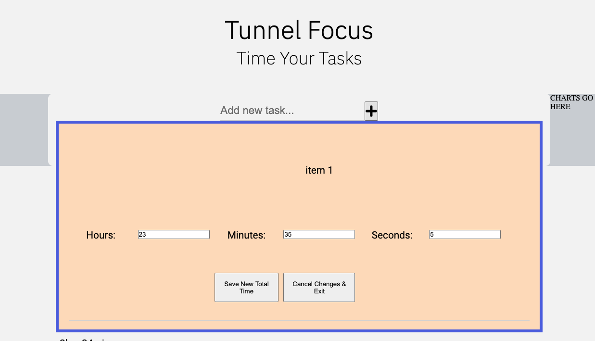

But this is what was happening on the second click without refreshing the page: 

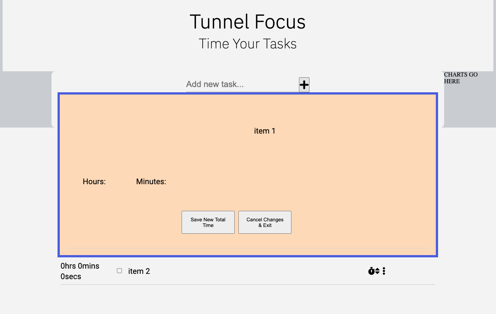

__FIX 1:__ The issue was that the click event handlers for the manual time edit button were adding up each time a user clicked on the button without refreshing the page. I eventually discovered this by examining the event listeners on that button at various stages of the function (as seen below): 

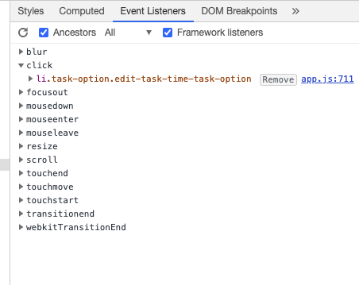
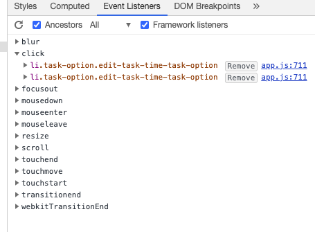

Then Haley from tutor support sent me [this](https://stackoverflow.com/questions/209029/best-way-to-remove-an-event-handler-in-jquery) useful information about using jQuery to effect a bind and unbind function on event listeners, in order to cancel or remove the event listeners of click and / or keyup. This worked a treat, as below:

                    $(this).unbind('click', arguments.callee);
                    $(this).unbind('keyup', arguments.callee);


__ISSUE 2:__ The new inputs created by the manualTaskTimeEdit() function allowed users to input negative numbers as time to add to a task. This is a logical impossibility, so I needed to find a way to make it impossible for a user to do this. 

__FIX 2:__ I found [this](https://stackoverflow.com/questions/31575496/prevent-negative-inputs-in-form-input-type-number) code on Stack Overflow which I added to the input construction as an attribute/value pair. 

__ISSUE 3:__ This worked for manual inputs of time, but users could still input negative numbers by using the down arrows in the number input section. 

__FIX 3:__  Where I dynamically set each edit box of time, I added the code `newTime.setAttribute("min", "0");` which effectively made it impossible to use the arrows to set a time less than 0. 

__ISSUE 4:__ Not so much an issue, more an explainer, but the scope of this function was expanded on my mentor's suggestion that I merge it with the edit task function. This made sense, as there was no sound logic for separating the two editing capabilities. 

__FIX 4:__ I was able to merge all of the edit task code (with alterations) into the manually edit task time function, as well as create a shared modal window.

__ISSUE 5:__ If a user opened the edit task modal, didn't change any of the time variables, but altered the task description OR even just instead of clicking cancel, they clicked save changes, the application was adding a time segment to the associated array, which was in turn making that task appear in the "Total time focused on each task today" chart legend. It was correct insofar as it registered 0hrs 0mins 0secs, but there was no need for it to be there. 

__FIX 5:__ I added the following if statement within the editTask() method:

            if (totalTimeToAdd !== 0) {
                list.taskList[taskToTargetId].timeSegments.push({id, timeToAdd, dateStamp, taskDescription, localDate, localTime});
            }    
Thus ensuring that if no time is added, but the task description is edited, the name will change correctly, but the task will not appear in the "today" chart legend.  

__ISSUE 6:__ The bind() & unbind() jQuery methods that I integrated to fix ISSUE 1, worked a treat, except that because they have been deprecated, they were throwing the following TypeError in the console:

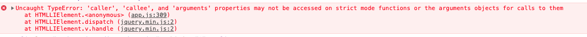

__FIX 6:__ I re-jigged the way I wrote all of the functions that relied on bind & unbind and I included a location.reload() command when I needed to "unbind" event listeners. I'm aware that this is less than ideal, especially since one of the benefits of JS is that pages don't need to be reloaded that often, but my method did avoid errors in the console, so that was the trade-off. For future releases I will further investigate methods of avoiding event listener bugs without resorting to reloading.

## editTask() 
*Original Method integrated with the above*

__METHOD SUMMARY__: This method takes the ```<li>``` that holds the task description and replaces it in the DOM with an input element that uses the li's task description attribute as it's value. The user can then edit the input and click on a save button to save the new task description.

__ISSUE 1:__ Once the user had clicked to "edit task" button, they were free to click on it again, as many times as they wanted which could lead to this situation:  

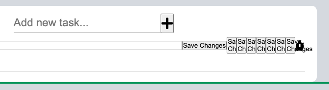

__FIX 1:__ I added a conditional that only allowed the edit method to be called if the save button was not already in the DOM: ```if (!document.querySelector('.save-button')){```


- ## Timer.convertSecondsToTime(seconds)

__FUNCTION SUMMARY:__ Takes in seconds and converts them into hours, minutes and seconds in a human readable format. The code was taken from a Stack Overflow question and is referenced in the attribution section of this README. 

__ISSUE 1:__ I could not call this method from within other functions in this class. timer.convertSecondsToTime would not work. I kept getting a ```"Uncaught ReferenceError: convertSecondsToTime is not defined"```

__FIX 1:__ I had instantiated a local variable called timer and used it to refer to the timer container in the DOM. So calling timer.convertSecondsToTime() when trying to refer to an instance of the Timer Object called timer, was not actually doing that and was indeed not defined. Changing the variable name to timerContainer fixed the issue. 

- ## addOverlay() & removeOverlay(); 

__FUNCTION SUMMARY:__ This function appends a div with the class 'overlay' to the body of the page. This overlay sits on top of the page at z-index: 1000 effectively disabling the page contents. removeOverlay() reverses the function.

- ## addSilentAlarm() & removeSilentAlarm()

__FUNCTION SUMMARY:__ This function creates a silent alarm of flashing colours for users who want to be alerted in a more subtle manner. It works simply by removing the overlay class and adding the silent-alarm class which is defined in CSS code as an infinite animation scrolling through all the colours in the app's colour theme. The rather slow 15 second animation time, is to avoid strobing. I took the CSS for the animation structure from Zak's codepen (attributed in README).

- ## makeElementsNotKeyboardTabbable() && makeElementKeyboardTabbableAgain();

__FUNCTION SUMMARY:__ These functions solved the issue of when an option was opened for example "edit task" - the user could break the application by tabbing through elements in the background, even when the yellow overlay was applied. makeElementsNotKeyboardTabbable() goes through each of the background elements and sets: `"tabindex", "-1"` and makeElementKeyboardTabbableAgain() does the opposite. 


## Task Class

### *Properties*: 
- taskDescription (string)
- id (integer)
- completed (boolean)
- order (integer)
- totalTimeFocusedOnTask (integer)
- totalTimeFocusedOnTaskLongForm (string);
- timeSegments (array)


## List Class
### *Properties*: 
- taskList (array of objects)

### *Methods*:
- buildTaskList()
- addNewTask()
- toggleTaskComplete()
- editTask()
- deleteTask()
- dynamicPopoverNav()
- setDataToLocalStorage()


## buildTaskList()

__METHOD SUMMARY__: This method takes the tasks stored in local storage and writes them to the DOM for use. If there is nothing saved in local storage an empty array is returned from the Class definition and that is used. 
The method loops through each task stored in the taskList array and divides them into complete and incomplete tasks. 


__ISSUE 1:__ When writing tasks to the DOM, I needed to find a way to distinguish between completed and incomplete tasks.

__FIX 1:__ Firstly I used the aforementioned if / else if conditional logic within the loop of tasks in the task array, dividing the html blocks into those with "checked" and those without.

__FIX 2:__ The other necessity to logging the completed tasks correctly was to call the toggleTaskComplete() method within buildTaskList()

## addNewTask()
__METHOD SUMMARY__: This method adds a new task to the DOM and also saves it into the taskList array as a Task Object with certain default properties. The method then clears the input value in the DOM and sets it up so that other methods are functional on the new task. 

__ISSUE 1:__ Empty strings are being loggied as new tasks. I have conditional code saying ```if((newTaskInput !== null) && (newTaskInput !== "")){``` only then allow a new task 
to be created, and this works to a degree. If a user doesn't write anything and tries to add a task, they are blocked from doing so. However if they press the space bar a few times, 
a new empty string is added as a task. 

__FIX 1:__ I used the w3schools information on trim() to remove the whitespace around the task input before adding it to the task list. Specifically I used the regex function they list to strip all tasks of excess whitespace before they are processed and added to the list.

                function myTrim(x) {
                return x.replace(/^\s+|\s+$/gm,'');
                }

                newTaskInputValue = myTrim(newTaskInputValue);

This had the effect of ensuring that all tasks had no whitespace before they were processed by the next part of the function which checks that: 

            if((newTaskInputValue !== null) && (newTaskInputValue !== "") && (newTaskInputValue !== " ")){

Before the trim function a user could enter multiple spaces using the spacebar and it would fall through the cracks as it was not null, nor was the value "". Now the regex function strips every empty task entered with multiple spacebars down to "", triggering an alert asking the user to enter a task. 

__ISSUE 2:__ I needed to find a way to connect the Task Object in memory to the representation of the task in the DOM. 

__FIX 2:__ My first solution was to link the objects and DOM elements using the task descriptions. I figured that if I pushed the tasks into the array based on comparing what the user 
has entered as a task - then the task descriptions are always going to be identical, and I can therefore summon the task object using the html task and vice-versa.

__ISSUE 3:__ When manually testing this function, conjointly with the editTask() and deleteTask() functions, I discovered a massive flaw.  If a user writes in two identical tasks, and proceeds
to edit or delete one of them, the entire app would break as it would not be able to discern between the two and know which to delete or edit. 

__FIX 3:__ My solution was to change from using task descriptions to using ids. The Task object ids are set when they are initialised and they are based on the current length of the taskList array.
This way the ids will always run from 0 upwards and they will always match the id attributes of their html counterparts, which are set on the ```<li>``` task elements. This solution also led to a series
of bugs discussed [here](LINK TO delete() bugs).  

## toggleTaskComplete()

__METHOD SUMMARY__: This method listens for a change event on the checkboxes. If the change is that the checkbox is 'checked' then the method adds a 'completed' class to the task and sets the checkboxes 'checked' attribute to be 'true'. Variables are then created to display the local time and date for when the task completion happened. The full taskList is then looped through to match the DOM task in question with its corresponding task object, and a number of things happen: 
1. The task object is marked as completed = true.
2. The task timeSegments array is added to, with the task id and properties representing the date and time, as well as the taskDescription. This is to get around a bug that happens if a user doesn't add any time to a task, but still decides to mark that task as completed. In the former situation (and without this timeSegment added), the task would not appear in the list of tasks completed 'today', as the dateTime stamp is normally applied to the task object, when time is added. This way, the date is added to the timeSegments array (which is where the function pertaining to the 'today tasks' looks for data) even though timeAdded remains 0. This bug and fix is further clarified in the associated function below. (NAME IT).

If the checkbox checked is false, the 'completed' class is removed from the tasks classList and the task object is also marked as not completed.

The tasks' new statuses are then saved to local storage. 


## deleteTask()
__METHOD SUMMARY__: This method deletes a task both from the taskList object array and from the DOM list of tasks. 

__ISSUE 1:__ When I changed the connection between Task objects and their html representations from the task descriptions to the task ids, it led to 
the following bug: when a user deletes a task, it is removed from the html and the taskList array. Therefore when a new task in instantiated based on 
the length of the taskList array, it is most likely that there will be two tasks with the same id number in the array. Again this would completely break the application.

__FIX 1:__ I fixed this by using two small for loops that run just after tasks are deleted. The first re-numbers the task object ids from 0 upwards: 
        
                        let tList = list.taskList;
        
                        for (let i=0; i<tList.length; i++){
                            tList[i].id = i;
                        }

And the second re-numbers the DOM tasks also from 0 upwards: 

                        let arrOfDomTasks = document.querySelectorAll('.task-description');
                        
                        for (let i=0; i<arrOfDomTasks.length; i++){
                        arrOfDomTasks[i].id = i.toString();
                        }

This way the html tasks and Task objects will always have the same ids and can therefore be connected seamlessly.

__ISSUE 2:__ This solution however, created another bug that behaved oddly. If a user loads a previously saved list from local storage, adds some tasks and then checks off some of the new tasks, and then adds another task, the checkmarks were disappearing on some of the newer additions. They still had a "checked" attribute when investigated and they still had the "complete" class assigned to them to draw the line through them, but the application was not registering the visual checkmark on the page. 

__FIX 2:__ I debugged this using the Chrome JavaScript debugger, and the breakpoints pointed at the particular method causing the error. The addNewTask method calls the toggleTaskComplete() method when it finishes running, to ensure that checkmark capability is available for the new task added. The debugger pointed to the part of the toggleTaskComplete() method where it checks if the item is 'checked' and if it is to add the class "completed". For some reason, this is where the actual ticks in the checkboxes were being removed from the items. I found that adding: ```checkbox.setAttribute("checked", true)``` fixed the issue by explicitly forcing the "checked" attribute on all new task additions.

__ISSUE 3:__ When I tested my (almost) finalised application on mobile I found that the "delete task" link did not work. It worked perfectly in the browser & in the mobile mock up of Chrome Dev Tools, but clicking the delete task link on mobile or ipad devices had no effect. 

__FIX 3:__ I backtracked through my commits and eventually discovered that changing the "more options" ellipsis from an ```<a>``` tag to a ```<button>``` to enhance ARIA accessibility was to blame. As a fix, I just reverted back to an ```<a>``` tag although semantically perhaps not completely accurate. As a compromise I have ensured that all the ```<a>``` links have ARIA labels that clearly describe their purpose.  

## dynamicPopoverNav()
__METHOD SUMMARY__: This code creates and sets the options for the tippy.js popover box that this application uses for presenting the various options to the user. The code is taken directly from the tippy.js documentation.

__ISSUE1:__ The popover. For my application's wireframed design to work, I needed to dynamically summon the navigation popover (containing edit, delete, timers etc...), on a specific task, as all the options relate to a particular task. They are not general. I created an array of ellipsis icons that I iterated through and added an event listener for clicks. When any of the icons were clicked the popover would appear over the associated icon. 
I started by using getBoundingClientRect() as illustrated below. 

            const ellipsisArray = document.querySelectorAll('.task-options');
            const popover = document.getElementById('popover');

            ellipsisArray.forEach(icon=>{
                icon.addEventListener('click', function(event){
                    let ellipsis = event.target;
                    console.log(ellipsis.getBoundingClientRect());
                    popover.style.top = (ellipsis.getBoundingClientRect().y).toString()+"px";
                    popover.style.left = (ellipsis.getBoundingClientRect().x - 95).toString()+"px";

                    window.addEventListener('scroll', function(){
                        popover.style.top = (ellipsis.getBoundingClientRect().y).toString()+"px";
                        popover.style.left = (ellipsis.getBoundingClientRect().x - 95).toString()+"px";
                    })

                    popover.style.zIndex = "1";
                    
                })
            })
            if(popover.style.zIndex === "1"){
                !ellipsisArray.addEventListener('click', function(){
                    console.log("something else clicked.")
                })
            }

__FIX 1:__ I added an amount of px to the top and left of this, but that didn't work as the top and left values are dependent on page scroll. I.e. when I scrolled 
up the page, the location of the popover shifted dramatically. I needed to make it relative to the ellipsis itself **and** responsive to scroll events. I started 
playing around with the x & y offsets on the page, and then in an angry burst of stack overflowing, I happened upon tippy.js, which enabled me to implement the exact 
functionality I wanted in less than 15 minutes. Long live tippy.js

__ISSUE 2:__ While tippy.js is wonderful, I found that the keyboard accessibility would not automatically close the popover from the previous task before opening a new task item further down the list. This led to the following untidy situation, which would be quite irritating for keyboard users: 

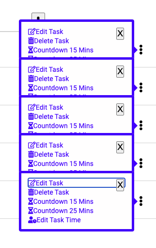

__FIX 2:__ As you can see above, I started trying to fix this issue by creating an X close button, that was clickable and keyboard tabbable, while this worked (sort of) using visibility and z-index, I then found a less hacky way in the closed issues on the developer's github repo using an object plugin that was actually in the documentation. The plugin is called hideOnPopperBlur and is attributed in the code and README.md file. 

__ISSUE 3:__ Another issue I found, was that when a user went to select an option from the popover options list, for example they click on "Edit Task", the popover did not disappear immediately, which is the functionality I believe makes the most sense. The tippy.js default is that it disappears when the user clicks anywhere else on the screen, but I felt that it should be hidden immediately to avoid this ugly situation: 

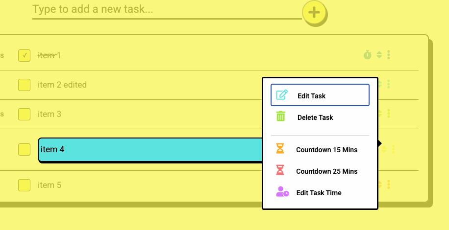

__FIX 3:__ I created my own tippy.js plugin to deal with this issue. ```hideOnOptionSelect``` It follows the recommended plugin formula for tippy.js and it includes an event listener for clicks on any of the popover options. Instead of looping through the array of popover options, I chose to create const variables for each of the four targeted options and then using || operators within my IF statement to outline the desired behaviour. This approach worked better within the parameters of the tippy.js plugin formula.  


## setDataToLocalStorage()
__METHOD SUMMARY__: A short method to stringify the taskList array and save its data to localStorage. This method is called whenever the user changes or adds to their
tasks. 

This actually required a good bit of testing and moving the method around to understand where and how it was saving the data. 

__ISSUE 1:__ Initially I had not realised that every time localStorage is set, it completely overwrites the previous save. I had initially set it to save after each individual 
task was created, which of course meant that there was only ever a single task saved. 

__FIX__ 1: I made sure that the method was placed so as to save the entire list each time localStorage is set.

## Productivity Chart Functions

The chart functions are separate to the OOP approach, but they draw from and integrate into many of the object methods.

## clearChartArea()

__FUNCTION SUMMARY:__ This function looks to see if there is a chart, a circle legend or a list present in the chart area and if there is, it removes them to clear space for a new one to be loaded in. 

## selectChart(data)

__FUNCTION SUMMARY:__ This function is called automatically on page load with the data used being the totalTimeFocusedOnEachTask. This function encapsulates all of the D3.js code that creates the donut charts I use to display the task time data. It starts by outlining the width & height of the svg area. It then sets the radius for the donut chart and the colour range to use for the slices/arcs. Here I matched these to my colour theme. D3.js goes on to create the chart using the totalTimeFocusedOnTask property of each task looked at. 

When the user hovers over any of the individual donut slices, the data for that slice will be displayed alongside the todo item task description. 

The legend is then built up from the same data's taskDescription. The colour is made to match the donut slice colours and the positioning is translated to best fit the screen. 

Finally the D3.js code is determined by which chart option a user selects. I have a "change" event listener on the drop-down menu and the function applies the selectChart() function feeding it different data for each of the two chart options. Then it applies the completedTaskList() function also with different data for each of the list options. 

__ISSUE 1__: I needed my svg charts to change size rather more dramatically on smaller screens (under 576) than was the case, also the responsivefy() function's algorithm was making the legend impossible to read on mobile screens. 

__FIX 1__: I added if / else statements to anonymous functions to set the width and height of the chart svgs. Although somewhat more prescriptive, this worked well in tangent with the responsivefy() function. 

__ISSUE 2__: When the task descriptions were very long the legend didn't fit on screen. 

__FIX 2__: I used slice to limit the length of the legend task Description to 50 chars. 

__ISSUE 3__: The legend box proved difficult to position correctly depending on how many items were in the task list. 

__FIX 3__: I included a function that set the height property of the legend dynamically if there were more than 6 items in the list. 

__ISSUE 4__: When a user selects a chart / list on mobile it zooms in to the selection, but did not zoom out again to the normal view. 

__FIX 4__: I found a solution by Warren Chandler (attributed in README) that added some scale attributes to the application's meta tag, as below: 

```< meta name="viewport" content="width=device-width, initial-scale=1.0, maximum-scale=1.0,user-scalable=0"/>```

While this isn't an ideal solution, as disabling zooming can have unforeseen consequences, it hasn't affected this particular application negatively and the alternative was impacting user experience. 

## getTodayTasks()

__FUNCTION SUMMARY:__ This function takes all the tasks in the taskList array of objects and then loops through each task's individual timeSegments array of objects and compares the timeSegment's local date to the current date at the time of calling the function. If the two dates are the same, i.e. if the task was saved 'today', then it pushes that timeSegment into a new array called todaysTasks. 

The function then loops through the todaysTasks array and pushes the tasks into a temporary object using their task Id as a key, and then it merges tasks with the same id and sums their timeToAdd values. The idea being that we will be left with a single amount of time spent on that task in the 'today' timespan. 

Another array is then created called todaysTasksFiltered and the properties in the temp object are looped through and pushed into that array, so as to have the structure of an array of objects which is need to create the associated d3.js chart.

__ISSUE 1:__ This function introduced me to the concept of 'passing by reference' for JavaScript objects. Initially the following code meant that for multiple timeSegments on a task, on a particular day, the first timeSegments value in the original task object was changing to the fully summed value as undertaken by this function. This meant that each time the total time spent on a task "today" was calculated the result was artifically inflated because the summed result of previous calculations was being added to genuine time segments. This bug is easier to show than explain: 

1. Three tasks are worked on "today" 
2. The first task is worked on, on 3 separate occasions for 4seconds, 3 seconds & 4 seconds. 
3. The other two tasks are just worked on once each. 
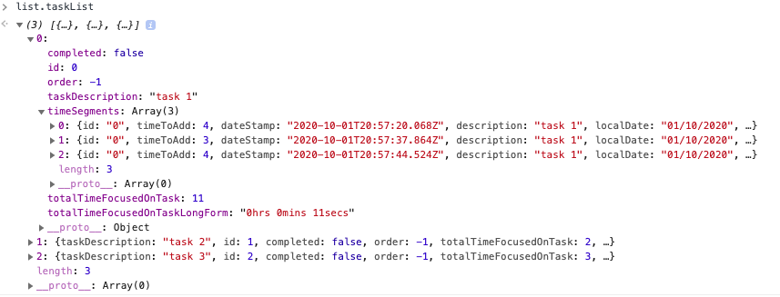

4. getTodayTasks() is called to create a chart. 
5. It successfully sums the first task into a single object displaying 11 seconds worked on the task. 

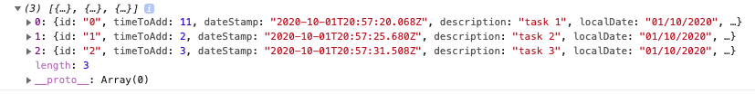
6. The user adds another task and works on it for a number of seconds. 
7. To update the chart, the user calls getTodayTasks again. 
8. But now the first task is registering as having 18seconds of total time worked on it. And if we look at the original task object, to our *horror* we see that the function has mutated the original time segment as well. 
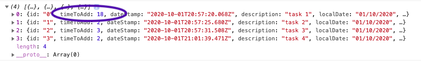
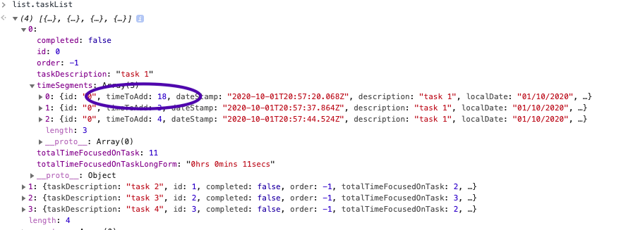

__FIX 1:__ The fix was just to add a spread operator at the point where the object first gets passed into the function:

            for(var i=0; i < todaysTasks.length; i++) {
                task = {...todaysTasks[i]}; 

This created a shallow copy of the original object, and thus left the original time segment alone, and stopped artificially inflating the task times. 

__ISSUE 2:__ When a user went to edit a task description, the new task description would not be updated in the legend for "Total Time Focused on Each Task Today", this was because of how that code is structured, it uses a temporary array and the first time a task was placed in that array, that task's description would remain the reference description. 

__FIX 2:__ This issue was solved by adding the * line below ensuring that the most up to date task description in the local storage taskList array is placed into the "todaysTasksFiltered" array and thus reflected in the chart legend. 

            for (let i=0; i<todaysTasksFiltered.length; i++){
                    for (let j=0; j< list.taskList.length; j++){
                        if(todaysTasksFiltered[i].id == list.taskList[j].id){
                            todaysTasksFiltered[i].completed = list.taskList[j].completed;
                          *  todaysTasksFiltered[i].taskDescription = list.taskList[j].taskDescription;
                        }
                    }
                }


## completedTaskList(data)

__FUNCTION SUMMARY:__ This function builds up the two lists: "Tasks Completed" and "Tasks Completed Today" and writes them to the DOM. First it clears the chart area. It takes in data as a parameter and then for each item in that data array it assesses whether or not that task is "completed" and if it is, it adds it to the DOM list.

## responsivefy(svg)

__FUNCTION SUMMARY:__ This function is taken from Ben Clinkenbeard's Blog Article and originally written by Brendan Sudol. It effectively makes the charts responsive to window size changes and I use it as a filler function in between my media queries that change the sizing of the charts. 

# Code Validators

## HTML Validators

## [W3C HTML Validator](https://validator.w3.org/)

- Warning 1: ```Consider avoiding viewport values that prevent users from resizing documents.```
    The line referred to was explicitly written to avoid an annoying zooming effect on certain mobile browsers. So I felt that user experience was improved by my code, so I've left it in.

- Warning 2: ```The document is not mappable to XML 1.0 due to two consecutive hyphens in a comment.```
    This was because I prefered the look of look comments of the type: <!---------------------- Comment ---------------------->
    But I changed them back to regular comments to allow mapping to XML

- Warnings 3,4,5 & 6: ```Empty heading.```
    The headings referenced are dynamically generated by the tasks inputted, so I have left these alone.

- Warning 7: ```The type attribute is unnecessary for JavaScript resources.```
    I was unaware of this, but I removed it.

- Error 1: ```An element with the attribute tabindex must not appear as a descendant of the a element.```
    The anchor tag in this case was unneccesary, so I changed it to a ```<div>```.

- Error 2: ``` Element span not allowed as child of element ul in this context.```
    The span tag was not needed and was changed to a ```<li>``` tag. 

In summary the HTML validates perfectly, with the exceptions of the empty heading warnings & the viewport values which I have chosen to ignore for enhanced usability.

## [W3C Link Checker](https://validator.w3.org/checklink)

- All anchors and links were valid.

## CSS Validators

## [W3 CSS Validator](https://jigsaw.w3.org/css-validator/)

- One 'Value Error' was thrown by the validator referencing my checkbox linear gradient. Saying that 
    ```"Value Error : background too few values for the property linear-gradient )"```
    However as [this discussion](https://stackoverflow.com/questions/12537546/w3-css-validation-value-error-for-gradients/12537684) explains this has more to do with the communication between the working version of CSS3 & the validator.

- A number of warnings were thrown by the validator referencing my vendor extensions. But as the [following discussion](https://stackoverflow.com/questions/52490004/what-are-all-of-these-w3c-css-validation-warnings-about) illustrates, this is to be expected.

- The rest of the code validated.

## JavaScript Validators

## [JSHint](https://jshint.com/)

- Ran all functions through JSHint and its primary complaint was to do with how much of my code was written is ES6. The use of const & let and template literals. 

- I found no substantive errors using this tool. 

- Mostly it enabled me to spot the hundreds of semi-colons I had omitted, which I corrected. 

# Web Development Tools Testing

I ran my finished application through both Lighthouse & web.dev Measure, both very useful tools for gauging usability and site performance.

It scored well on both measures:

## Lighthouse

### Overall Scores:

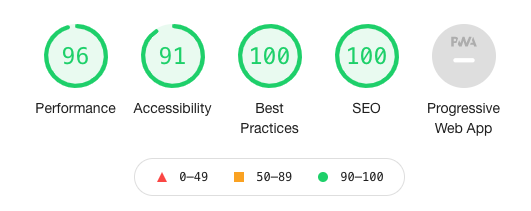

### Performance:
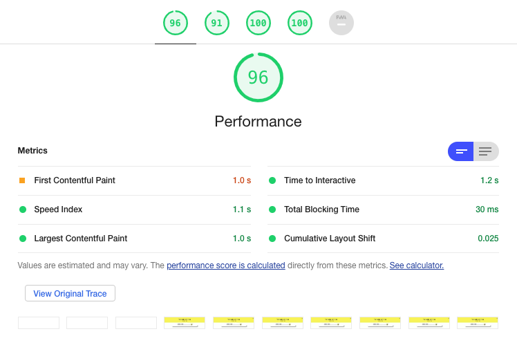

### Accessibility:

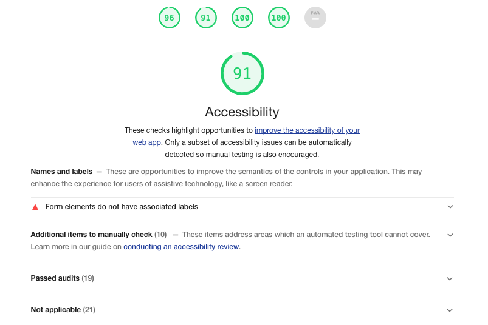

### Best Practices:
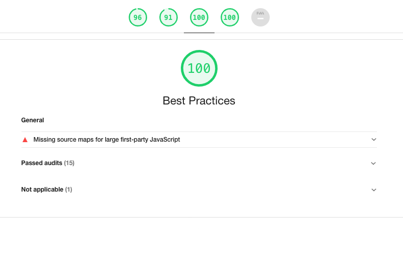

### SEO:
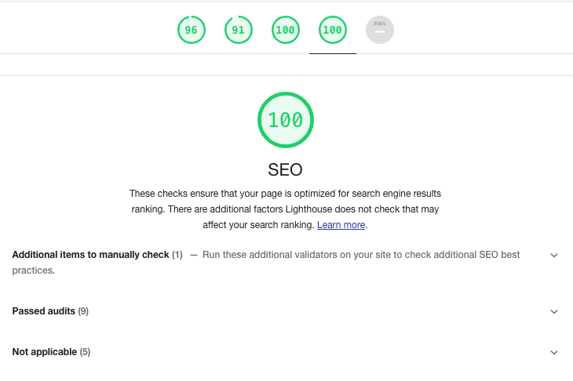

## Web Dev Measure

Oddly enough (because they are essentially the same tool) the site's performace suffered on the web.dev measure, but the points minused were mostly to do with all the unused D3.js code.
It also wanted me to minify my JavaScript, which can be easily done at a later date. 

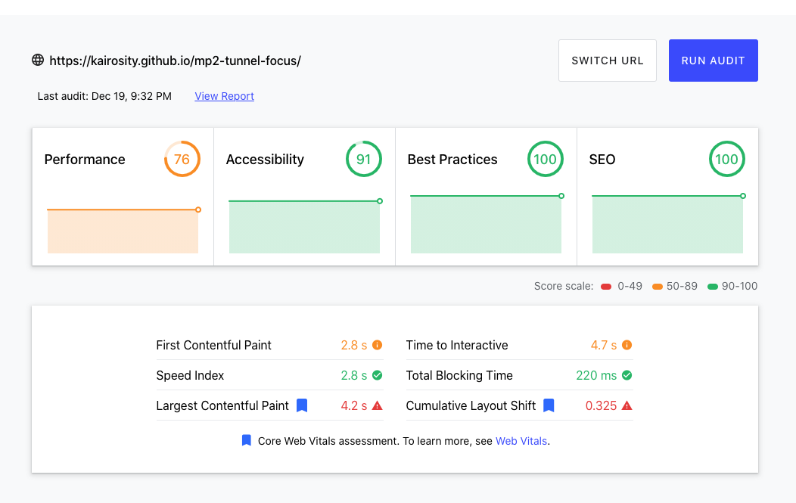
